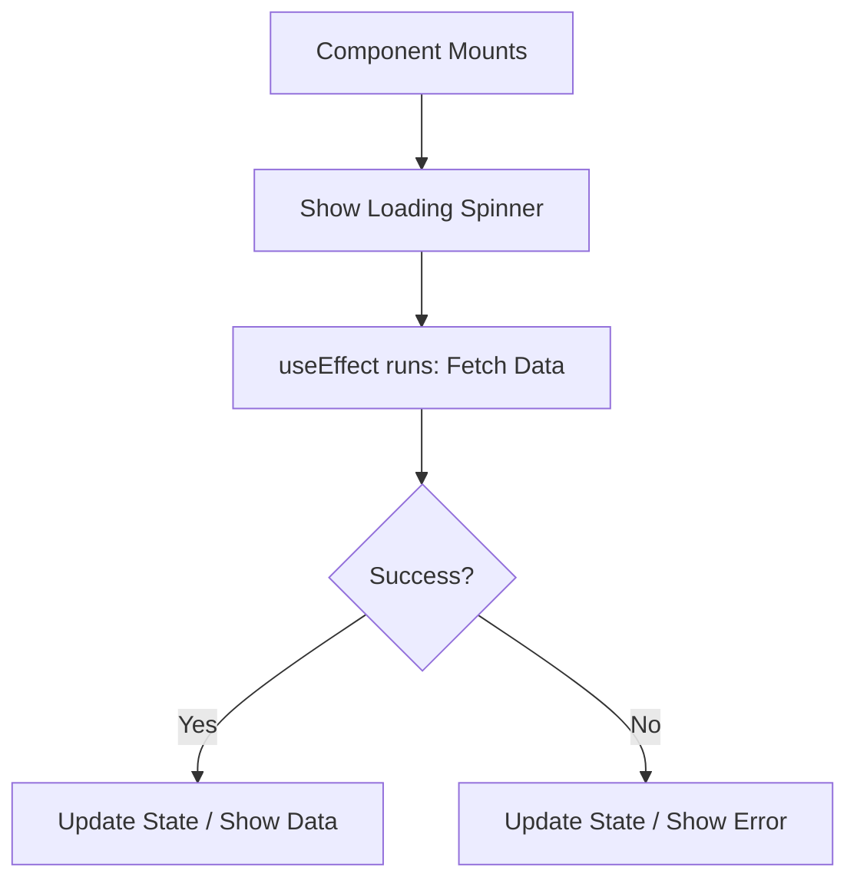

- Category: Data Fetching
- Track: React
- Difficulty: Intermediate
- Related: useEffect, promises, async-await

### API Calls in React
In React, fetching data from an external API is usually done inside the `useEffect` hook. This ensures that the network request happens after the component is rendered.

---

### 1. Data Fetching Flow
**Working Flow: The Loading Lifecycle**



---

### 2. Standard Fetch Pattern
**Theory**: Use `useState` to track the data, the loading status, and any potential errors.
```tsx
function UserProfile({ userId }) {
  const [user, setUser] = useState(null);
  const [loading, setLoading] = useState(true);

  useEffect(() => {
    setLoading(true);
    fetch(`https://api.com/users/${userId}`)
      .then(res => res.json())
      .then(data => {
        setUser(data);
        setLoading(false);
      });
  }, [userId]); // Re-run if userId changes

  if (loading) return <p>Loading...</p>;
  return <div>{user.name}</div>;
}
```

---

### 3. Modern Pattern: Async/Await
**Theory**: Async/Await makes the fetching logic much cleaner and easier to read.
```tsx
useEffect(() => {
  const loadData = async () => {
    try {
      const res = await fetch(url);
      const data = await res.json();
      setData(data);
    } catch (err) {
      setError(err.message);
    } finally {
      setLoading(false);
    }
  };
  loadData();
}, [url]);
```

---

### 4. Best Practices
- **Clean up**: Cancel requests if the component unmounts to prevent "memory leaks".
- **Loading States**: Always provide visual feedback (Skeleton or Spinner).
- **Error Handling**: Don't assume the API will always work.
- **Libraries**: For complex apps, use libraries like **React Query** or **SWR** which handle caching and re-fetching automatically.

---

### 5. Summary Table

| Method | Best For | Pros |
| :--- | :--- | :--- |
| **Fetch API** | Simple apps | Built-in, no dependencies |
| **Axios** | Medium/Large apps | Automatic JSON parsing, interceptors |
| **React Query** | Production apps | **Caching**, auto-retry, easy state |

---

[View Interview Questions](./interview.md)
