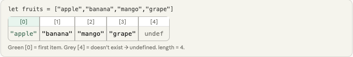
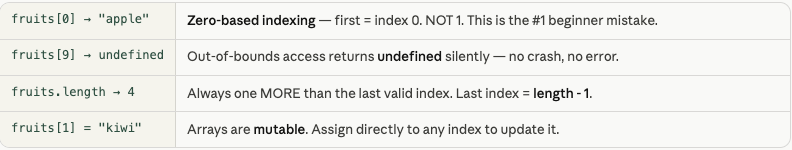
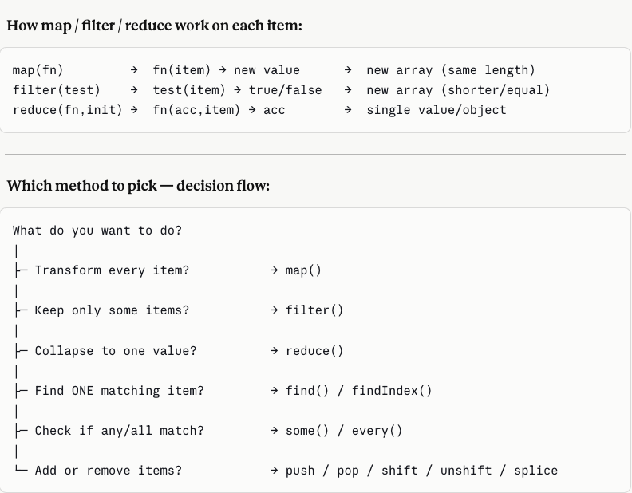
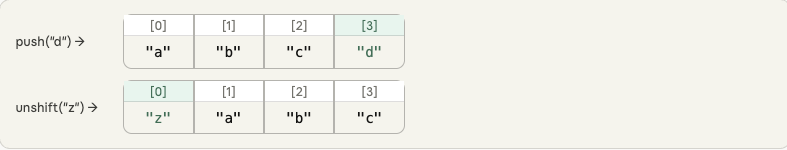
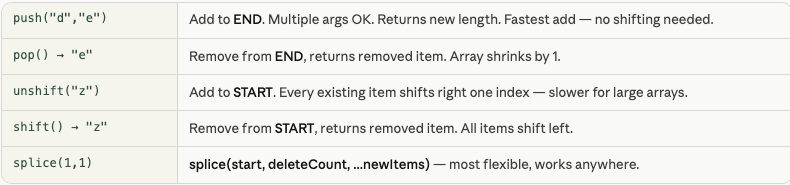
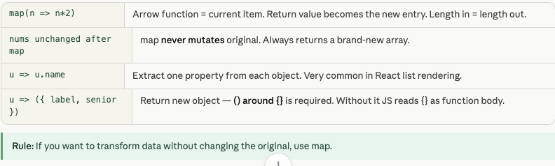
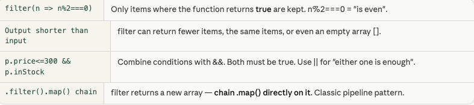
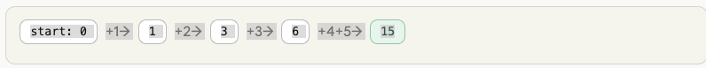
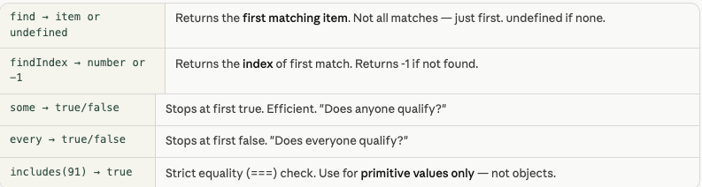
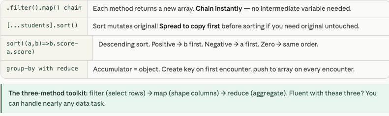

- Category: JavaScript
- Difficulty: Beginner
- Related: es6-features

### Array basics — create, read, modify
An array is an `ordered list` starting at index 0. Think of it as a numbered shelf — slot 0 is first, slot 1 is second. You get any item instantly by its index number.

**Analogy**
Train with numbered compartments. Compartment 0 = first. You board by saying "give me compartment 2". The train knows its total length at all times (.length).



**Example**
```javascript
let fruits = ["apple","banana","mango","grape"];

fruits[0]              // → "apple"   (first)
fruits[2]              // → "mango"   (third)
fruits[fruits.length-1]// → "grape"   (last)
fruits[9]              // → undefined (no crash!)
fruits.length          // → 4

fruits[1] = "kiwi";    // modify slot 1
fruits[1]              // → "kiwi"

let mixed = [42, "hi", true, null, [1,2]];
mixed[4]               // → [1,2]  (nested array)
```

**Output**
```
fruits[0]              → "apple"
fruits[2]              → "mango"
fruits[length-1]       → "grape"
fruits[9]              → undefined
fruits.length          → 4
after fruits[1]="kiwi" → "kiwi"
mixed[4]               → [1,2]
```



**push, pop, shift, unshift — add & remove Methods**
**Theory**: Four methods for adding/removing items. push/pop work at the END. shift/unshift work at the START. Pop and shift return the removed item.

- `push()`: Adds to the **end**.
- `pop()`: Removes from the **end**.
- `unshift()`: Adds to the **beginning**.
- `shift()`: Removes from the **beginning**.

**Analogy**
Queue at a counter. push = join the back. pop = last person leaves. unshift = cut to the front. shift = first person served and leaves.



```javascript
let arr = ["a","b","c"];

arr.push("d","e");   // → ["a","b","c","d","e"]  add to END
let last = arr.pop();// last = "e", arr = ["a","b","c","d"]

arr.unshift("z");    // → ["z","a","b","c","d"]  add to START
let first=arr.shift();// first = "z", arr = ["a","b","c","d"]

// splice — add/remove anywhere in middle
arr.splice(1,1);           // remove 1 at index 1 → ["a","c","d"]
arr.splice(1,0,"X","Y");   // insert at 1 → ["a","X","Y","c","d"]
```

**Output**
```
after push(d,e)       → ["a","b","c","d","e"]
pop() returned        → "e"
after pop()           → ["a","b","c","d"]
after unshift(z)      → ["z","a","b","c","d"]
shift() returned      → "z"
after shift()         → ["a","b","c","d"]
after splice(1,1)     → ["a","c","d"]
after splice(1,0,X,Y) → ["a","X","Y","c","d"]
```


---

### 2. Transforming Data (map)
**Theory**: `map()` is used when you want to transform *every* element in an array. It creates a brand **new array** of the exact same length.

**Working Flow**
```text
[ 1, 2, 3, 4 ] --> ( num * 2 ) --> [ 2, 4, 6, 8 ]
Input length 4 → output length 4. Original untouched.
```

**Example**:
```javascript
let nums = [1,2,3,4,5];

let doubled = nums.map(n => n * 2);
// → [2,4,6,8,10]
console.log(nums);  // → [1,2,3,4,5]  UNCHANGED

let labels = nums.map(n => "item" + n);
// → ["item1","item2","item3","item4","item5"]

// Objects — extract one field
let users = [
  { name:"Alice", age:28 },
  { name:"Bob",   age:35 },
];
let names = users.map(u => u.name);
// → ["Alice","Bob"]

// Transform to a new object shape
let cards = users.map(u => ({
  label: u.name.toUpperCase(),
  senior: u.age >= 30
}));
// → [{label:"ALICE",senior:false},{label:"BOB",senior:true}]
```

**Output**
```
doubled          → [2,4,6,8,10]
nums (unchanged) → [1,2,3,4,5]
labels           → ["item1","item2","item3","item4","item5"]
names            → ["Alice","Bob"]
cards[0]         → {label:"ALICE",senior:false}
cards[1]         → {label:"BOB",senior:true}
```



### 3. filter — keep only matching items
**Theory**: `filter()` Runs a test on every item. Keeps only those where the test returns true. Returns a new array that can be shorter. Original never changes.

**Analogy**:
Bouncer at a club. Every person walks up. Bouncer checks (your function). Only those who pass get in. The original guest list stays unchanged.

**Working Flow**
```text
[ 1,2,3,4,5,6 ] --> ( n % 2==0 ) --> [ 2, 4, 6]
```

**Example**:
```javascript
let nums = [1,2,3,4,5,6,7,8,9,10];

let evens = nums.filter(n => n % 2 === 0);
// → [2,4,6,8,10]

let big = nums.filter(n => n > 6);
// → [7,8,9,10]

let products = [
  { name:"Phone", price:800, inStock:true  },
  { name:"Bag",   price: 50, inStock:false },
  { name:"Watch", price:200, inStock:true  },
];
let cheap     = products.filter(p => p.price <= 200);
let available = products.filter(p => p.inStock);
let deals     = products.filter(p => p.price <= 300 && p.inStock);

// chain filter + map
let dealNames = products
  .filter(p => p.price <= 300 && p.inStock)
  .map(p => p.name);
// → ["Watch"]
```

**Output**
```
evens             → [2,4,6,8,10]
big (>6)          → [7,8,9,10]
cheap (≤200)      → [Bag,Watch]
available         → [Phone,Watch]
deals (≤300+stock)→ [Watch]
deals names       → ["Watch"]
```


### 4. reduce — collapse to one value
**Theory**: Processes every item and accumulates a single result — a number, string, object, or array. It takes a reducer function and a starting value (initial value).

**Analogy**:
Analogy
Adding up a grocery bill. Start with ₹0 (initial value). Cashier scans each item and adds its price to running total (accumulator). After all items → one final bill.


**Working Flow**


**Example**:
```javascript
let nums = [1,2,3,4,5];

// Sum — start at 0
let sum = nums.reduce((total, n) => total + n, 0);
// → 15

// Max value
let max = nums.reduce((big,n) => n>big ? n : big, -Infinity);
// → 5

// Count occurrences (accumulator = object!)
let votes = ["yes","no","yes","yes","no","yes"];
let tally = votes.reduce((count, v) => {
  count[v] = (count[v] || 0) + 1;
  return count;   // ← must return accumulator!
}, {});
// → { yes:4, no:2 }

// Real-world: cart total
let cart = [{name:"Phone",price:800},{name:"Cable",price:15}];
let total = cart.reduce((sum,p) => sum + p.price, 0);
// → 815
```
**Output**:
```
sum              → 15
max              → 5
vote tally       → {yes:4, no:2}
cart total       → ₹815
```
**Common mistake:** Forgetting return count inside the callback. Without it the accumulator becomes undefined on next iteration.


### 5. find, findIndex, some, every, includes
**Theory**: Search and inspection methods. Each answers a specific question about your array data. They short-circuit — stopping as soon as they have an answer.

**Quick reference** 
`find`= give me ONE item that matches. findIndex = at what position? some = does anyone match? every = does everyone match? includes = is this value present?

**Key Methods**:
- `includes()`: Returns `true` or `false` if the exact value exists.
- `find()`: Returns the **first item** (usually an object) that matches a condition, or `undefined` if not found.

**Example**:
```javascript
let scores = [45, 82, 60, 91, 73];

// find — FIRST matching item (or undefined)
scores.find(s => s >= 60)    // → 82
scores.find(s => s > 99)     // → undefined

// findIndex — index of first match (or -1)
scores.findIndex(s => s > 80) // → 1  (82 is at index 1)

// some — at least one passes?
scores.some(s => s > 90)     // → true  (91 exists)
scores.some(s => s > 99)     // → false

// every — ALL pass?
scores.every(s => s > 40)    // → true
scores.every(s => s > 60)    // → false  (45 fails)

// includes — exact value present?
scores.includes(91)          // → true
scores.includes(100)         // → false

// With objects
let users=[{name:"Alice",active:true},{name:"Bob",active:false}];
users.find(u => u.name==="Bob")  // → {name:"Bob",active:false}
users.some(u => !u.active)       // → true
users.every(u => u.active)       // → false
```

**Output**:
```
find(>=60)        → 82
find(>99)         → undefined
findIndex(>80)    → 1
some(>90)         → true
some(>99)         → false
every(>40)        → true
every(>60)        → false
includes(91)      → true
includes(100)     → false
find Bob          → {name:"Bob",active:false}
some inactive     → true
every active      → false
```



### 6. Chaining methods — real-world pipelines
**Theory**: Because map/filter/reduce each return a new array or value, you can chain them one after another. This creates clean, readable data pipelines — the backbone of real JS and React development.


**Example**:
```javascript
let students = [
  { name:"Alice", score:88, city:"Mumbai"  },
  { name:"Bob",   score:45, city:"Delhi"   },
  { name:"Cara",  score:92, city:"Mumbai"  },
  { name:"Dan",   score:71, city:"Chennai" },
];

// All names
students.map(s => s.name)
// → ["Alice","Bob","Cara","Dan"]

// Only passing (score >= 60)
students.filter(s => s.score >= 60).map(s => s.name)
// → ["Alice","Cara","Dan"]

// Mumbai students who passed — chained
students
  .filter(s => s.city==="Mumbai" && s.score>=60)
  .map(s => s.name)
// → ["Alice","Cara"]

// Average score
let avg = students.reduce((sum,s)=>sum+s.score,0) / students.length;
// → 74  (rounded)

// Top scorer (sort copy, then pick first)
let top = [...students].sort((a,b)=>b.score-a.score)[0].name;
// → "Cara"

// Group by city
let byCity = students.reduce((g,s)=>{
  g[s.city] = g[s.city]||[];
  g[s.city].push(s.name);
  return g;
},{});
// → {Mumbai:["Alice","Cara"], Delhi:["Bob"], Chennai:["Dan"]}
```

**Output**:
```
all names         → ["Alice","Bob","Cara","Dan"]
passing (>=60)    → ["Alice","Cara","Dan"]
mumbai+pass       → ["Alice","Cara"]
average score     → 74
top scorer        → "Cara"
Mumbai group      → ["Alice","Cara"]
Delhi group       → ["Bob"]
```



---
[View Interview Questions](./interview.md)
