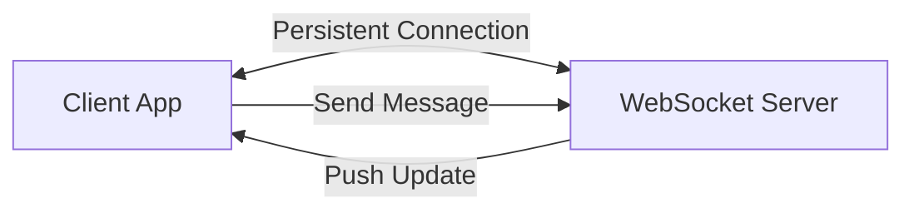

- Category: Networking
- Track: Web Development
- Difficulty: Intermediate
- Related: restful-api, graphql-api

### What are Asynchronous (Real-time) APIs?
Traditional APIs (like REST) are "Request-Response". The client asks, and the server answers. **Asynchronous APIs** allow the server to push data to the client without being asked, enabling real-time features like chat, live scores, or notifications.

---

### 1. The Real-time Flow
**Working Flow: Bidirectional Communication**



---

### 2. Common Technologies

#### WebSockets (WS)
**Theory**: A persistent connection between client and server that allows full-duplex (two-way) communication. Great for chat apps.
```javascript
const socket = new WebSocket('ws://example.com/socket');
socket.onmessage = (event) => console.log("New message:", event.data);
socket.send("Hello Server!");
```

#### Server-Sent Events (SSE)
**Theory**: A one-way connection where the server pushes updates to the client. Simpler than WebSockets for "Read-only" live data like stock tickers.
```javascript
const source = new EventSource('/live-updates');
source.onmessage = (event) => updateUI(event.data);
```

#### Long Polling
**Theory**: The legacy way to simulate real-time. The client makes a request, the server holds it open until new data is available, then closes it and the client immediately repeats the process.

---

### 3. Comparison Table

| Feature | REST / GraphQL | WebSockets | SSE |
| :--- | :--- | :--- | :--- |
| **Direction** | One-way (Client -> Server) | **Two-way** | One-way (Server -> Client) |
| **Connection** | Temporary | **Persistent** | Persistent |
| **Overhead** | High (per request) | Low | Low |
| **Best For** | Standard CRUD | Chat, Games | News Feeds, Tickers |

---

### 4. Implementation Example (Socket.io)
**Theory**: Socket.io is the most popular library for handling WebSockets in JavaScript, providing automatic reconnection and fallbacks.
```javascript
import { io } from "socket.io-client";
const socket = io("https://server.com");

socket.on("connect", () => {
  console.log("Connected with ID:", socket.id);
});

socket.emit("join-room", "room1");
```

---

[View Interview Questions](./interview.md)
