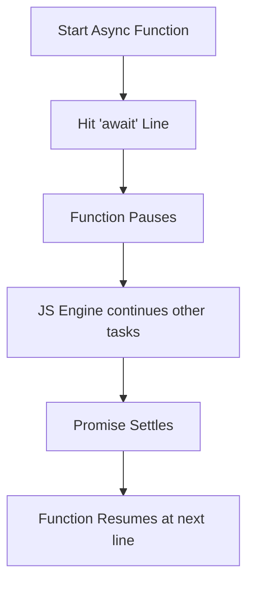

- Category: JavaScript
- Track: JavaScript
- Difficulty: Intermediate
- Related: promises, event-loop

### What is Async/Await?
**Async/Await** is a special syntax that makes it easier to work with Promises. It allows you to write asynchronous code that looks and reads like synchronous code, making it much easier to reason about.

---

### 1. Execution Flow
**Working Flow: How Await Pauses Execution**



---

### 2. Core Concepts

#### The 'async' Keyword
**Theory**: Adding `async` to a function ensures it **always returns a promise**. If the function returns a value, JavaScript automatically wraps it in a resolved promise.
```javascript
async function greet() {
  return "Hello";
}
greet().then(console.log); // "Hello"
```

#### The 'await' Keyword
**Theory**: The `await` keyword can only be used inside an `async` function. It tells JavaScript to wait for the promise to settle before moving to the next line.
```javascript
const data = await somePromise;
```

---

### 3. Comprehensive Examples

#### Parallel vs Sequential Execution
**Theory**: Don't use `await` for independent requests if you can run them in parallel.
```javascript
// ❌ SLOW: Total time = 4s (Wait for 1, then wait for 2)
const user = await fetchUser(); // 2s
const posts = await fetchPosts(); // 2s

// ✅ FAST: Total time = 2s (Both run at once)
const [user, posts] = await Promise.all([fetchUser(), fetchPosts()]);
```

#### Proper Error Handling
```javascript
async function safeFetch() {
  try {
    const res = await fetch("https://api.com/users");
    if (!res.ok) throw new Error("Failed to fetch");
    return await res.json();
  } catch (err) {
    console.error("Caught error:", err.message);
  }
}
```

---

### 4. Comparison Table

| Feature | Promises (.then) | Async / Await |
| :--- | :--- | :--- |
| **Readability** | "Chain" of callbacks | Top-to-bottom style |
| **Error Handling** | `.catch()` method | `try...catch` block |
| **Conditionals** | Harder to nest | Easy (standard `if/else`) |
| **Debugging** | Can be hard to step through | Very easy (steps line by line) |

---

[View Interview Questions](./interview.md)
