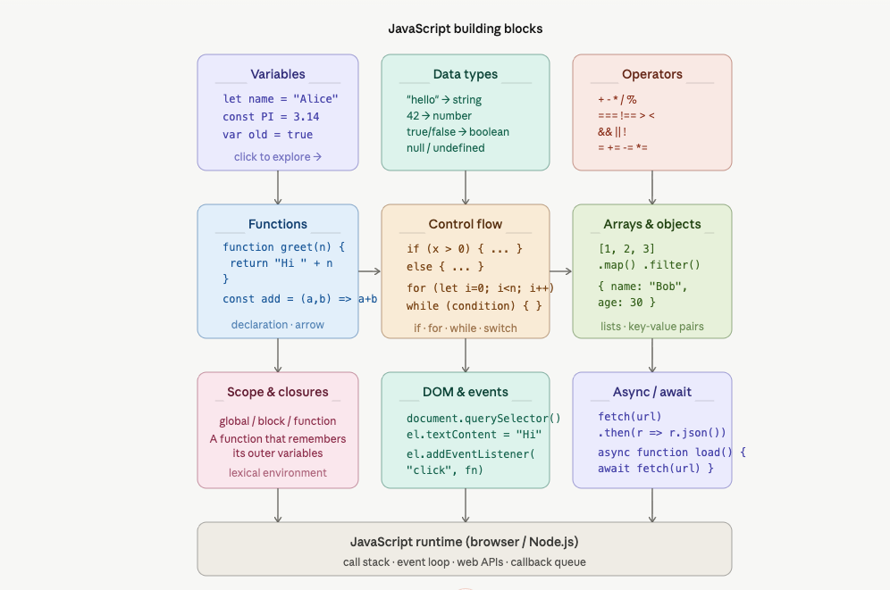

JavaScript is a programming language that makes websites interactive. Think of it like this:

- **HTML** = skeleton of a webpage (structure)
- **CSS** = clothes (styling)
- **JavaScript** = muscles (makes things move/work)

---

[View Interview Questions](./interview.md)