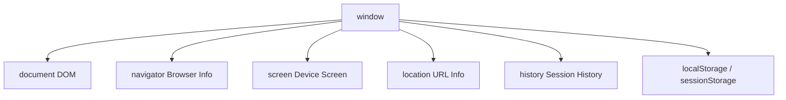

- Category: Core Concepts
- Track: JavaScript
- Difficulty: Intermediate
- Related: dom, event-loop

### What is the BOM?
The **Browser Object Model (BOM)** is a set of objects provided by the browser that allow JavaScript to interact with the browser itself, beyond just the HTML document. The root of the BOM is the `window` object.

---

### 1. BOM Hierarchy
**Working Flow: The Window as the Global Root**



---

### 2. Core BOM Components

#### window.location (URL Management)
| Property | Description | Example |
| :--- | :--- | :--- |
| `.href` | Full URL | `https://site.com/p?q=1` |
| `.pathname` | Path after domain | `/p` |
| `.search` | Query parameters | `?q=1` |
| `.reload()` | Refreshes the page | N/A |

#### window.navigator (User Environment)
| Property | Description |
| :--- | :--- |
| `.userAgent` | Browser and OS string |
| `.language` | Browser language (e.g., 'en-US') |
| `.onLine` | Returns true if connected |

---

### 3. Comprehensive Examples

#### URL Parsing
**Theory**: You can extract specific parts of the URL to handle routing or search functionality in your app.
```javascript
// URL: https://myshop.com/products?category=shoes#top
console.log(window.location.pathname); // "/products"
console.log(window.location.search);   // "?category=shoes"
console.log(window.location.hash);     // "#top"
```

#### Controlling Browser History
```javascript
// Go back to the previous page
window.history.back();

// Go forward one page
window.history.forward();

// Reload current page
window.location.reload();
```

---

### 4. Comparison: BOM vs DOM
| Feature | DOM (Document Object Model) | BOM (Browser Object Model) |
| :--- | :--- | :--- |
| **Focus** | The content of the page (HTML) | The browser window and environment |
| **Object** | `document` | `window` |
| **Standard** | W3C Standard | No single formal standard |

---

[View Interview Questions](./interview.md)
