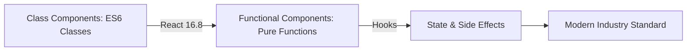

- Category: React Basics
- Track: React
- Difficulty: Beginner
- Related: component-lifecycle, hooks

### Class vs Functional Components
In React, there are two main ways to define a component: **Class Components** (the legacy way) and **Functional Components** (the modern way). Since React 16.8 (Hooks), functional components have become the industry standard.

---

### 1. The Evolution of Components
**Working Flow: From Classes to Hooks**



---

### 2. Side-by-Side Comparison

| Feature | Class Component | Functional Component |
| :--- | :--- | :--- |
| **Syntax** | ES6 Class (extends React.Component) | Plain JavaScript Function |
| **State** | `this.state` / `this.setState` | `useState` Hook |
| **Lifecycle** | Lifecycle Methods (e.g. `componentDidMount`) | `useEffect` Hook |
| **"this"** | **Required** (can be confusing) | **Not used** |
| **Boilerplate** | High (constructor, render, binding) | **Low** (concise code) |

---

### 3. Code Comparison

#### The Class Way
```tsx
class Welcome extends React.Component {
  render() {
    return <h1>Hello, {this.props.name}</h1>;
  }
}
```

#### The Functional Way (Modern)
```tsx
function Welcome({ name }) {
  return <h1>Hello, {name}</h1>;
}
```

---

### 4. Why the Shift to Functional Components?
**Theory**: Functional components are generally preferred because:
1. **Less Code**: They require significantly less boilerplate.
2. **Logic Sharing**: Hooks make it much easier to share stateful logic (Custom Hooks).
3. **No "this"**: Developers don't have to worry about binding methods or the confusing behavior of the `this` keyword.
4. **Performance**: They are easier for React to optimize and result in smaller bundle sizes.

---

### 5. Summary: Which one to use?
Always use **Functional Components** for new code. Use **Class Components** only if you need to maintain legacy code or implement an **Error Boundary** (which still requires a class).

---

[View Interview Questions](./interview.md)
