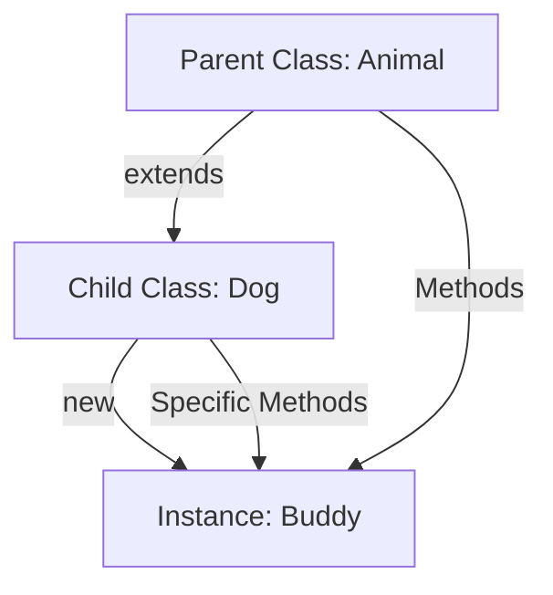

- Category: JavaScript
- Track: JavaScript
- Difficulty: Intermediate
- Related: prototypes, this-keyword

### What are Classes & Objects?
In JavaScript, **Classes** are templates (blueprints) for creating objects. They encapsulate data with code to manipulate that data. While JavaScript uses a prototype-based system, the `class` syntax (introduced in ES6) provides a much cleaner way to write Object-Oriented code.

---

### 1. Inheritance Flow
**Working Flow: Parent to Child**



---

### 2. Core OOP Concepts

#### The Constructor & "new"
**Theory**: The `constructor` is a special method for creating and initializing an object instance. The `new` keyword triggers this process.
```javascript
class Car {
  constructor(brand) {
    this.brand = brand;
  }
}
const myCar = new Car("Tesla");
```

#### Inheritance (extends & super)
**Theory**: A class can inherit properties and methods from another class. Use `extends` to link them and `super()` to call the parent's constructor.
```javascript
class Animal {
  constructor(name) { this.name = name; }
  eat() { console.log(`${this.name} eats.`); }
}

class Bird extends Animal {
  fly() { console.log(`${this.name} flies!`); }
}

const parrot = new Bird("Rio");
parrot.eat(); // Inherited
parrot.fly(); // Own method
```

---

### 3. Advanced Features

#### Getters and Setters
**Theory**: Use `get` and `set` to execute logic when a property is accessed or modified.
```javascript
class Person {
  constructor(name) { this._name = name; }
  
  get name() { return this._name.toUpperCase(); }
  set name(val) { this._name = val; }
}
```

#### Private Fields (`#`)
**Theory**: Prefix a property with `#` to make it truly private (only accessible inside the class).
```javascript
class BankAccount {
  #balance = 0; // Private
  deposit(amount) { this.#balance += amount; }
}
```

---

### 4. Summary Table

| Feature | Syntax | Purpose |
| :--- | :--- | :--- |
| **constructor** | `constructor() {}` | Initialize data |
| **extends** | `class A extends B` | Inherit from B |
| **super** | `super()` | Call parent constructor |
| **static** | `static fn() {}` | Utility fn on Class itself |
| **private** | `#field` | Hide data from outside |

---

[View Interview Questions](./interview.md)
