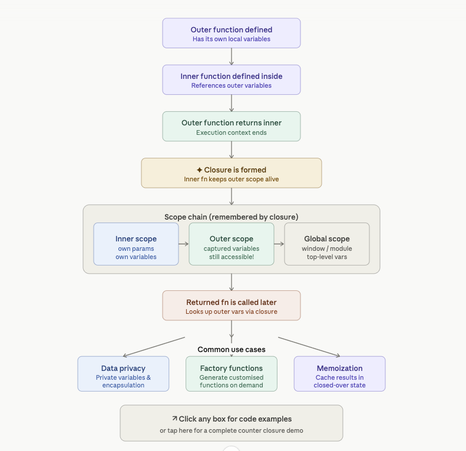

- Category: JavaScript
- Track: JavaScript
- Difficulty: Intermediate
- Related: hoisting

### What are Closures?
`The Concept`: A closure is a function that remembers and accesses variables from its outer scope even after the outer function has finished executing.

**Key Features**
- Retains access to outer function variables.
- Preserves the lexical scope.
- Allows data encapsulation and privacy.
- Commonly used in callbacks and asynchronous code.

**Example**:
```javascript
function makeCounter(start = 0) {
  // 'count' lives in makeCounter's scope
  let count = start;

  // These inner functions CLOSE OVER 'count'
  return {
    increment: () => ++count,
    decrement: () => --count,
    reset:     () => { count = start; return count; },
    value:     () => count,
  };
}

// makeCounter() has finished — but 'count' is NOT gone!
const counterA = makeCounter(0);
const counterB = makeCounter(10);  // independent closure

counterA.increment(); // 1
counterA.increment(); // 2
counterB.increment(); // 11  ← its own 'count'
```

**Output**
```
counterA.increment() → 1
counterA.increment() → 2
counterB.increment() → 11
```

**Explanation of the Output:**
counterA and counterB are two completely independent closures. Each call to makeCounter() creates a fresh execution context with its own count variable. They never interfere with each other — this is the key power of closures.
The makeCounter function is long gone by the time you press those buttons. Its stack frame was destroyed after it returned. But the inner arrow functions (increment, decrement, reset, value) still hold a live reference to that scope, keeping count and start alive in memory.
The returned object is essentially a small "module" — you can only touch count through the four methods. There is no way to do counterA.count = 999 from outside. That's data encapsulation for free, no class needed.


### 1. Lexical Scoping
**Theory**: Closures are rely on lexical scoping, which means a function’s scope is determined by where it is defined, not where it is executed, allowing inner functions to access variables from their outer function.

- Scope is fixed at function definition time.
- Inner functions can access outer function variables.
- Enables closures to “remember” their environment.

**Common Pitfalls**
- Memory Leaks: Excessive use of closures may retain unnecessary references to variables, causing memory issues.
- Performance Overhead: Overusing closures might lead to larger memory usage due to retained scopes.


**In React**
`In React,` closures are everywhere—every time you write a function inside a component, you are creating a closure. React relies on this behavior to manage state and props

**How React Uses Closures**
`State Access:` When you define an event handler (like handleClick), it "closes over" the current state. This means the function knows what the state was at the exact moment that specific version of the function was created.
`Async Operations:` Closures allow asynchronous functions (like fetch or setTimeout) to remember props and state from the time they were triggered, which helps prevent bugs where values change while a request is "in flight".
`Custom Hooks:` Hooks like useCounter use closures to keep state private while allowing your component to update it through returned functions like increment()

**Working Flow**



[View Interview Questions](./interview.md)
