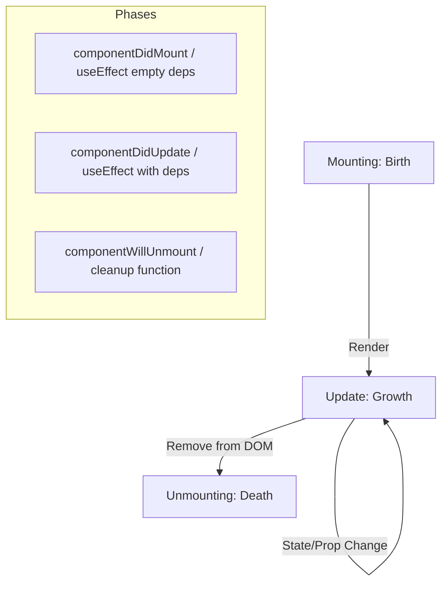

- Category: React Fundamentals
- Track: React
- Difficulty: Intermediate
- Related: useEffect, useState, useLayoutEffect

### Component Lifecycle
In React, components have a lifecycle that consists of three main phases: **Mounting**, **Updating**, and **Unmounting**. While functional components use Hooks to manage these phases, the underlying concept of "the life of a component" remains the same.

---

### 1. The Lifecycle Cycle
**Working Flow: From Birth to Death**



---

### 2. The Three Phases Breakdown

#### Mounting
**Theory**: When a component is being created and inserted into the DOM.
- **Hook**: `useEffect(() => { ... }, [])`
- **Purpose**: Fetching initial data, setting up subscriptions, or starting timers.

#### Updating
**Theory**: When a component's props or state change, causing a re-render.
- **Hook**: `useEffect(() => { ... }, [dependencies])`
- **Purpose**: Responding to data changes (e.g., re-fetching data when an ID changes).

#### Unmounting
**Theory**: When a component is being removed from the DOM.
- **Hook**: The **return function** inside `useEffect`.
- **Purpose**: Cleaning up timers, canceling network requests, or removing event listeners.

---

### 3. Comprehensive Examples

#### The Cleanup Pattern
**Theory**: The cleanup function doesn't just run on unmount; it runs **before the next effect** to clean up the previous render's side effects.
```tsx
useEffect(() => {
  const timer = setInterval(() => {
    console.log("Tick");
  }, 1000);

  // Cleanup: Prevents memory leaks
  return () => clearInterval(timer);
}, []);
```

#### Synchronous Layout (useLayoutEffect)
**Theory**: Use this only if you need to measure the DOM before the user sees the paint.
```tsx
useLayoutEffect(() => {
  const height = myRef.current.offsetHeight;
  console.log("Height before paint:", height);
}, []);
```

---

### 4. Summary Table: Hooks vs Class Methods

| Phase | Class Method | Functional Hook |
| :--- | :--- | :--- |
| **Mount** | `componentDidMount` | `useEffect(fn, [])` |
| **Update** | `componentDidUpdate` | `useEffect(fn, [deps])` |
| **Unmount** | `componentWillUnmount` | `useEffect(() => cleanup, [])` |

---

[View Interview Questions](./interview.md)
