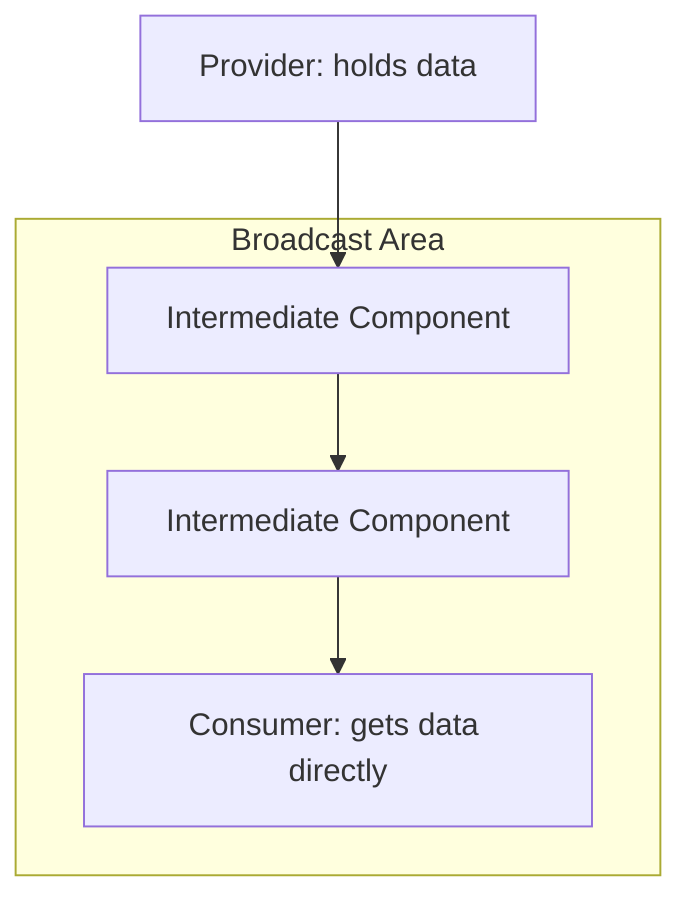

- Category: State Management
- Track: React
- Difficulty: Intermediate
- Related: useContext, props-drilling, redux

### What is the Context API?
The **Context API** is a built-in React feature that allows you to share data (state) across the entire component tree without having to pass props down manually through every level (**Prop Drilling**).

---

### 1. The Context Pattern
**Working Flow: Broadcasting Data**



---

### 2. The Three Steps of Context

#### 1. Create Context
**Theory**: Create a context object using `createContext()`.
```tsx
const ThemeContext = createContext('light');
```

#### 2. Provide Context
**Theory**: Wrap your component tree with a **Provider** to make the data available to all children.
```tsx
<ThemeContext.Provider value="dark">
  <App />
</ThemeContext.Provider>
```

#### 3. Consume Context
**Theory**: Use the `useContext` hook inside any child component to access the data.
```tsx
const theme = useContext(ThemeContext);
```

---

### 3. When to use Context?
Context is best for "global" data that doesn't change very often:
- **Theming**: Dark mode vs Light mode.
- **User Auth**: Logged-in user information.
- **Language**: Internationalization (i18n).
- **Settings**: App-wide configuration.

---

### 4. Comparison: Context vs Props

| Feature | Props | Context API |
| :--- | :--- | :--- |
| **Complexity** | Simple | More setup required |
| **Data Flow** | Explicit (Top-down) | **Implicit** (Broadcasting) |
| **Best For** | Component customization | **App-wide state** |
| **Maintainability** | Hard in deep trees | Easy in deep trees |

---

### 5. Summary: Performance Warning
**Theory**: Whenever the Context value changes, **all components** that consume that context will re-render. To avoid performance issues in large apps, keep your Context small and focused on one specific piece of data.

---

[View Interview Questions](./interview.md)
