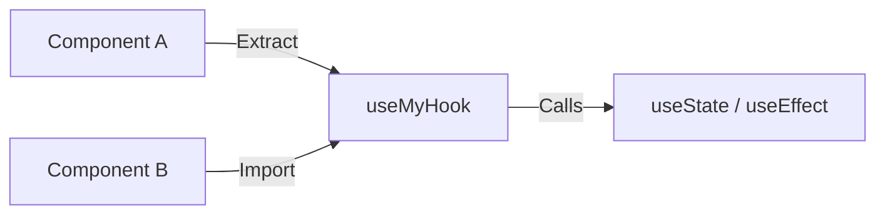

- Category: React Patterns
- Track: React
- Difficulty: Intermediate
- Related: useState, useEffect, useRef

### Custom Hooks
A **Custom Hook** is a JavaScript function whose name starts with `use` and that can call other Hooks. It allows you to extract component logic into reusable functions, making your components cleaner and your code easier to maintain.

---

### 1. Extraction Flow
**Working Flow: Moving Logic out of Components**



---

### 2. Core Principles

#### Independence of State
**Theory**: Every time you use a custom hook, all state and effects inside of it are **completely isolated**. Two components using the same custom hook do NOT share state.
```tsx
const [val1, setVal1] = useToggle(); // Instance A
const [val2, setVal2] = useToggle(); // Instance B (Independent)
```

#### Rules of Custom Hooks
1. **Name must start with `use`**: This tells React's linter that the function follows Hook rules.
2. **Follow the Rules of Hooks**: Don't call them inside loops, conditions, or nested functions.
3. **Pure Logic**: Custom hooks should focus on *logic*, not UI (they return data, not JSX).

---

### 3. Comprehensive Examples

#### useToggle (The Simplest Case)
```tsx
function useToggle(initialValue = false) {
  const [value, setValue] = useState(initialValue);
  const toggle = () => setValue(v => !v);
  return [value, toggle];
}
```

#### useWindowSize (Handling Events)
**Theory**: Perfect for wrapping browser events like `resize` or `scroll`.
```tsx
function useWindowSize() {
  const [size, setSize] = useState({ width: window.innerWidth, height: window.innerHeight });

  useEffect(() => {
    const handleResize = () => setSize({ width: window.innerWidth, height: window.innerHeight });
    window.addEventListener("resize", handleResize);
    return () => window.removeEventListener("resize", handleResize);
  }, []);

  return size;
}
```

---

### 4. Summary: Why use Custom Hooks?

| Benefit | Description |
| :--- | :--- |
| **Reusability** | Use the same logic across different components. |
| **Readability** | Keeps components focused on rendering, not logic. |
| **Testability** | You can test the logic independently from the UI. |
| **Abstraction** | Hide complex implementation details (like localStorage sync). |

---

[View Interview Questions](./interview.md)
