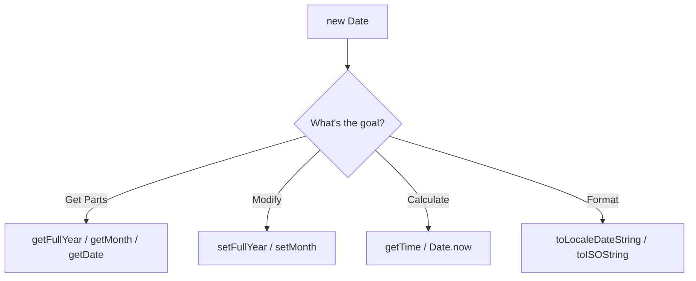

- Category: JavaScript
- Track: JavaScript
- Difficulty: Beginner
- Related: Fundamentals

### What are Date Methods?
The `Date` object is a built-in constructor used to work with dates and times. It stores dates as the number of milliseconds since January 1, 1970 (the Unix Epoch).

---

### 1. Date Lifecycle Flow
**Working Flow: Creation to Formatting**



---

### 2. Core Method Categories

#### Getter Methods (Read)
| Method | Returns | Range |
| :--- | :--- | :--- |
| `getFullYear()` | 4-digit year | e.g. 2024 |
| `getMonth()` | Month index | **0 (Jan) to 11 (Dec)** |
| `getDate()` | Day of month | 1 to 31 |
| `getDay()` | Day of week | 0 (Sun) to 6 (Sat) |
| `getHours()` | Hour | 0 to 23 |

#### Formatting & Timestamps
| Method | Description | Example |
| :--- | :--- | :--- |
| `getTime()` | Ms since Epoch | `1710500000000` |
| `toISOString()` | Standard string | `"2024-03-15T12:00:00Z"` |
| `Date.now()` | Current Ms (static) | `1710500000000` |

---

### 3. Comprehensive Examples

#### The Month Trap
**Theory**: In JavaScript, months are zero-indexed (0-11). Always add `+1` when displaying to users.
```javascript
const bday = new Date(2000, 0, 15); // Jan 15, 2000
console.log(bday.getMonth()); // → 0 (January)
```

#### Calculating Time Difference
```javascript
const start = Date.now();
// ... some process ...
const end = Date.now();
const elapsed = end - start;
console.log(`Process took ${elapsed}ms`);
```

#### Localized Formatting
```javascript
const now = new Date();
const options = { weekday: 'long', year: 'numeric', month: 'long', day: 'numeric' };
console.log(now.toLocaleDateString('en-US', options));
```
**Output**: `Friday, March 15, 2024` (Example)

---

### 4. Summary: getDay() vs getDate()
- `getDate()`: Returns the **number** of the day in the month (e.g., 15th).
- `getDay()`: Returns the **index** of the day in the week (e.g., 5 for Friday).

---

[View Interview Questions](./interview.md)
