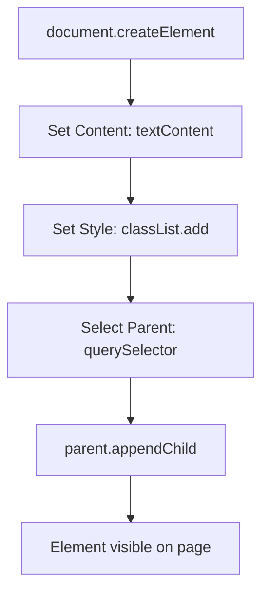

- Category: DOM Manipulation
- Track: JavaScript
- Difficulty: Beginner
- Related: events, bom

### What is the DOM?
The **Document Object Model (DOM)** is a programming interface for web documents. It represents the page as a tree of objects, allowing JavaScript to dynamically access and update the content, structure, and style of the website.

---

### 1. Element Creation Flow
**Working Flow: Creating and Mounting a New Element**



---

### 2. Core Manipulation Categories

#### Selection (Finding)
| Method | Description | Returns |
| :--- | :--- | :--- |
| `getElementById` | Find by ID | Single Element |
| `querySelector` | Find by CSS Selector | First Match |
| `querySelectorAll` | Find all matches | **NodeList** |

#### Modification (Changing)
| Property | Description | Safety |
| :--- | :--- | :--- |
| `textContent` | Plain text only | ✅ Safe |
| `innerHTML` | Parses HTML strings | ⚠️ XSS Risk |
| `classList` | Add/Remove CSS classes | ✅ Preferred over `.style` |

---

### 3. Comprehensive Examples

#### Creating Elements from Scratch
**Theory**: Instead of writing strings of HTML, it is safer and more performant to use the built-in creation methods.
```javascript
// 1. Create the element
const newDiv = document.createElement("div");

// 2. Customize it
newDiv.textContent = "New Item";
newDiv.classList.add("item", "active");

// 3. Place it in the DOM
document.body.appendChild(newDiv);
```

#### Working with Attributes
```javascript
const link = document.querySelector("a");

// Get and Set
link.setAttribute("href", "https://google.com");
console.log(link.getAttribute("href"));

// Classes (Modern way)
link.classList.add("active");
link.classList.toggle("hidden");
```

---

### 4. Comparison: NodeList vs Array
| Feature | NodeList (from querySelectorAll) | Array |
| :--- | :--- | :--- |
| `forEach` | ✅ Yes | ✅ Yes |
| `map/filter` | ❌ No | ✅ Yes |
| **Convert** | `Array.from(nodeList)` | N/A |

---

[View Interview Questions](./interview.md)
