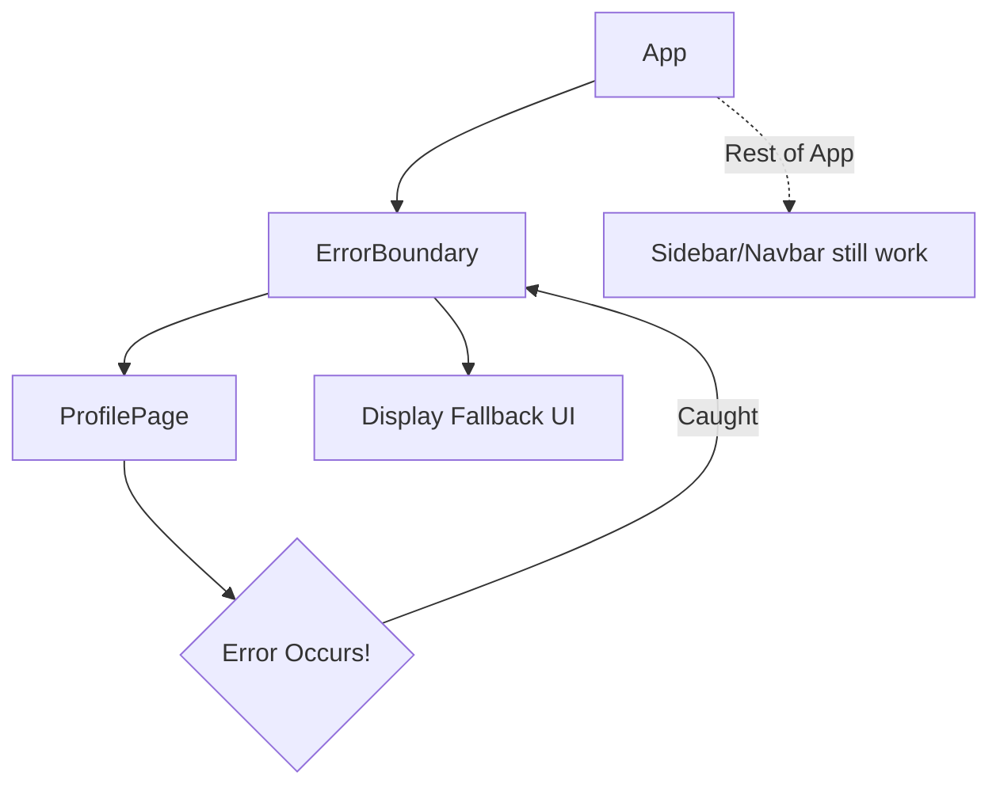

- Category: React Patterns
- Track: React
- Difficulty: Intermediate
- Related: error-handling, component-lifecycle

### What are Error Boundaries?
**Error Boundaries** are React components that catch JavaScript errors anywhere in their child component tree, log those errors, and display a fallback UI instead of the component tree that crashed.

---

### 1. Error Containment Flow
**Working Flow: Preventing a Full App Crash**



---

### 2. How they work
**Theory**: A class component becomes an error boundary if it defines either (or both) of the lifecycle methods `static getDerivedStateFromError()` or `componentDidCatch()`.

- **getDerivedStateFromError**: Used to render a fallback UI after an error has been thrown.
- **componentDidCatch**: Used to log error information (e.g., to an error reporting service like Sentry).

---

### 3. Implementation Example
**Note**: Error boundaries must be **Class Components**. There is currently no functional hook for this.

```tsx
class ErrorBoundary extends React.Component {
  constructor(props) {
    super(props);
    this.state = { hasError: false };
  }

  static getDerivedStateFromError(error) {
    // Update state so the next render shows the fallback UI.
    return { hasError: true };
  }

  componentDidCatch(error, errorInfo) {
    // You can also log the error to an error reporting service
    console.log(error, errorInfo);
  }

  render() {
    if (this.state.hasError) {
      return <h1>Something went wrong.</h1>;
    }
    return this.props.children; 
  }
}
```

---

### 4. What they DON'T catch
Error boundaries do **not** catch errors for:
- Event handlers (use `try/catch` inside the handler).
- Asynchronous code (e.g. `setTimeout` or `requestAnimationFrame`).
- Server-side rendering.
- Errors thrown in the error boundary itself (rather than its children).

---

### 5. Best Practice: Granularity
**Theory**: Don't just wrap your entire app in one Error Boundary. Wrap specific, high-risk sections (like a Sidebar or a Chart) so that if one fails, the rest of the app stays functional.

---

[View Interview Questions](./interview.md)
