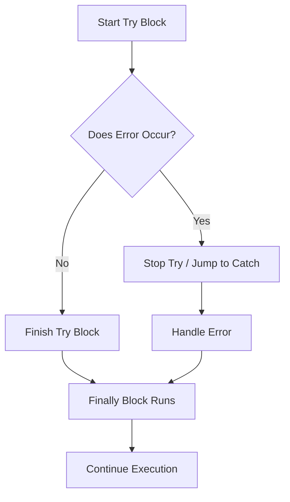

- Category: JavaScript
- Track: JavaScript
- Difficulty: Beginner
- Related: promises, async-await

### What is Error Handling?
Errors are inevitable in software development. **Error Handling** is the process of anticipating, detecting, and resolving errors in your code so that the application doesn't crash unexpectedly and can provide helpful feedback to the user.

---

### 1. Error Propagation Flow
**Working Flow: The try-catch-finally Cycle**



---

### 2. Built-in Error Types
JavaScript has several standard error types that help you identify what went wrong:

| Type | Meaning | Example |
| :--- | :--- | :--- |
| **ReferenceError** | Variable doesn't exist | `console.log(undefinedVar)` |
| **TypeError** | Value is not the expected type | `null.f()` or `const x=1; x=2` |
| **SyntaxError** | Code is not valid JS | `if (true) {` (missing bracket) |
| **RangeError** | Number is out of range | `new Array(-1)` |

---

### 3. Advanced Handling Patterns

#### Custom Error Classes
**Theory**: You can create your own error types to provide more specific information in large applications.
```javascript
class ValidationError extends Error {
  constructor(message) {
    super(message);
    this.name = "ValidationError";
  }
}

function validate(user) {
  if (!user.email) throw new ValidationError("Email is required");
}
```

#### The Async Trap
**Theory**: Standard `try...catch` cannot catch errors inside a basic `setTimeout` or a raw `.then()`. You must use `async/await` for the block to work as expected.
```javascript
// ❌ FAILS: Error happens after try/catch finished
try {
  setTimeout(() => { throw new Error("Boom"); }, 100);
} catch (e) {
  console.log("Caught!"); // Never runs
}

// ✅ WORKS: Await pauses the block
async function fetchUser() {
  try {
    const data = await riskyRequest();
  } catch (e) {
    console.log("Caught correctly!");
  }
}
```

---

### 4. Best Practices
1. **Never use an empty catch**: Always at least log the error.
2. **Be specific**: Throw `new TypeError()` if a type is wrong, rather than a generic `Error()`.
3. **Use Finally**: Always use `finally` to close database connections or hide loading spinners.

---

[View Interview Questions](./interview.md)
