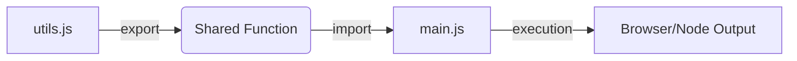

- Category: JavaScript
- Track: JavaScript
- Difficulty: Beginner
- Related: es6-features

### What are ES Modules (ESM)?
ES Modules are the official standard for modularizing JavaScript code. They allow you to break your code into separate files and share functionality using `import` and `export` statements.

---

### 1. Module Dependency Flow
**Working Flow: Exporting to Importing**



---

### 2. Core Export & Import Types

#### Named Exports (Multiple per file)
**Theory**: Use named exports when you want to share multiple values from a single file. They must be imported using their exact names inside `{}`.
```javascript
// math.js
export const add = (a, b) => a + b;
export const PI = 3.14;

// app.js
import { add, PI } from './math.js';
```

#### Default Exports (One per file)
**Theory**: A file can have only one default export. It can be imported with any name and does not use `{}`.
```javascript
// Logger.js
export default function log(msg) { console.log(msg); }

// app.js
import myLogger from './Logger.js';
```

---

### 3. Comprehensive Examples

#### Renaming with 'as'
```javascript
import { add as sum } from './math.js';
console.log(sum(5, 5)); // 10
```

#### Import All as a Namespace
```javascript
import * as MathUtils from './math.js';
console.log(MathUtils.add(1, 2));
console.log(MathUtils.PI);
```

#### Dynamic Imports
**Theory**: Load modules only when needed (lazy loading) to improve performance. Returns a promise.
```javascript
if (userClicked) {
  const module = await import('./heavy-chart-lib.js');
  module.renderChart();
}
```

---

### 4. Comparison: ESM vs CommonJS
| Feature | ES Modules (ESM) | CommonJS (CJS) |
| :--- | :--- | :--- |
| **Syntax** | `import / export` | `require / module.exports` |
| **Loading** | Static (Async) | Dynamic (Sync) |
| **Browser** | Native Support | Requires Bundler (usually) |
| **Tree Shaking** | ✅ Enabled | ❌ Harder to achieve |

---

[View Interview Questions](./interview.md)
