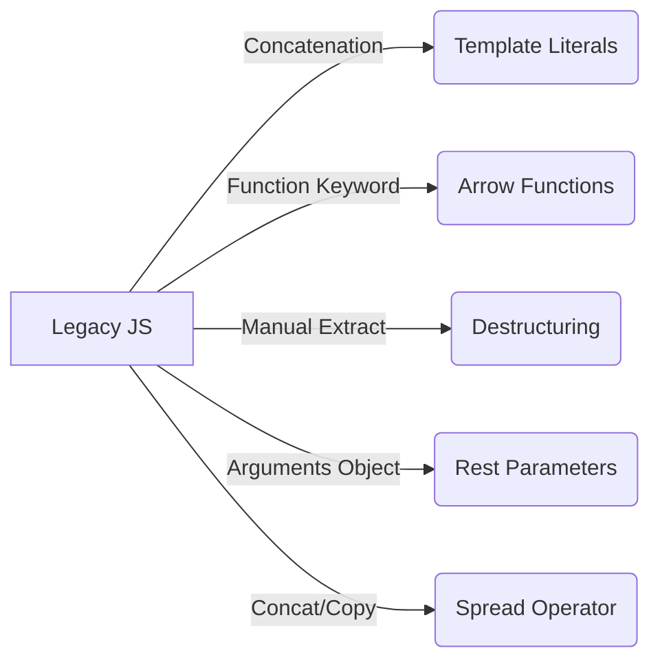

- Category: JavaScript
- Track: JavaScript
- Difficulty: Beginner
- Related: variables, array-methods, this-keyword

### What are ES6+ Features?
ES6 (ECMAScript 2015) was the most significant update to JavaScript in its history. It introduced modern syntax that makes code cleaner, more readable, and less error-prone.

---

### 1. Evolution of Syntax
**Working Flow**



---

### 2. Core Features & Examples

#### Template Literals
**Theory**: Use backticks (``) to create strings with embedded expressions and multi-line support.
```javascript
const name = "Richa";
const greeting = `Hello ${name}!
Welcome to the modern JS wiki.`;
```
**Output**: 
```
Hello Richa!
Welcome to the modern JS wiki.
```

#### Destructuring
**Theory**: Quickly extract values from objects or arrays into variables.
```javascript
// Object Destructuring
const config = { port: 8080, timeout: 5000 };
const { port, timeout } = config;

// Array Destructuring
const colors = ["red", "blue"];
const [primary, secondary] = colors;
```

#### Spread & Rest Operators (`...`)
**Theory**: 
- **Spread**: "Expands" an array or object.
- **Rest**: "Gathers" multiple elements into a single array.
```javascript
// Spread (Clone/Combine)
const nums = [1, 2, 3];
const newNums = [...nums, 4, 5]; // [1, 2, 3, 4, 5]

// Rest (Function Params)
function sum(...args) {
  return args.reduce((total, n) => total + n, 0);
}
sum(1, 2, 3); // → 6
```
**Output**: `6`

#### Arrow Functions
**Theory**: Shorter syntax for functions. They do not have their own `this` binding.
```javascript
const add = (a, b) => a + b;
const square = n => n * n;
```

---

### 3. Summary Table

| Feature | Syntax | Benefit |
| :--- | :--- | :--- |
| **Destructuring** | `const {x} = obj` | Cleaner variable extraction |
| **Spread** | `[...arr]` | Easy cloning and merging |
| **Default Params** | `function(a=1)` | Prevents undefined errors |
| **Arrow Fn** | `() => {}` | Concise syntax, lexical this |

---

[View Interview Questions](./interview.md)
