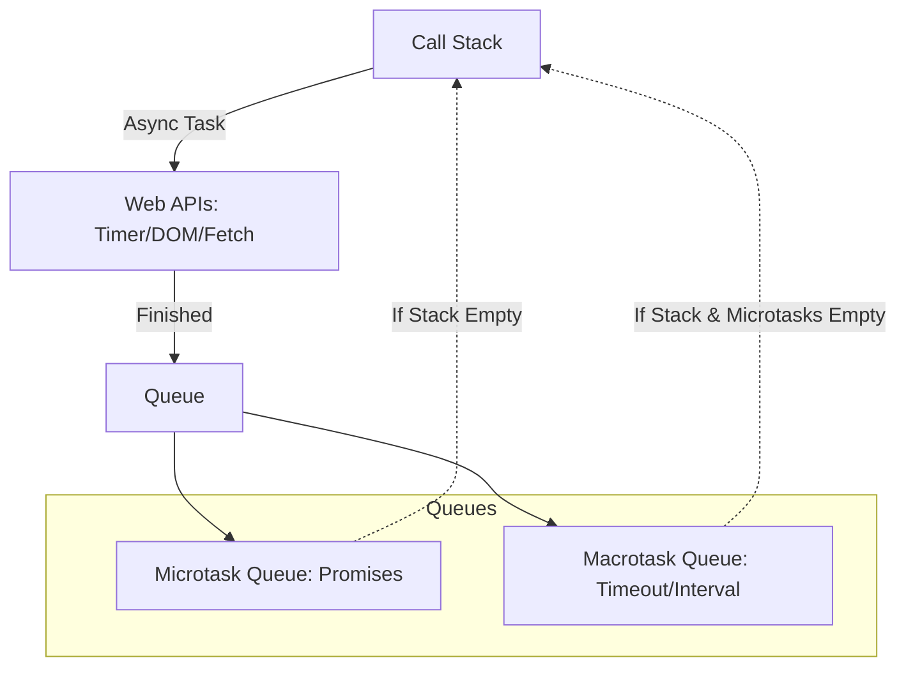

- Category: JavaScript
- Track: JavaScript
- Difficulty: Advanced
- Related: promises, async-await

### What is the Event Loop?
JavaScript is **single-threaded**, meaning it can only do one thing at a time. The **Event Loop** is the mechanism that allows JavaScript to perform non-blocking I/O operations by offloading tasks to the browser (Web APIs) and picking them up when the main stack is empty.

---

### 1. The Event Loop Cycle
**Working Flow: How tasks move through the system**



---

### 2. The Components

#### The Call Stack
Where synchronous code is executed. It follows **LIFO** (Last In, First Out).

#### Web APIs
The browser provides these (e.g., `setTimeout`, `fetch`, DOM events). They run in the background outside the JS engine.

#### Queues (Task vs Microtask)
- **Microtask Queue**: High priority. Includes `Promise.then`, `MutationObserver`.
- **Macrotask Queue**: Lower priority. Includes `setTimeout`, `setInterval`, `setImmediate`.

---

### 3. Execution Priority
**Theory**: The Event Loop follows a strict order:
1. Execute all synchronous code in the **Call Stack**.
2. Execute **ALL** tasks in the **Microtask Queue**.
3. Execute **ONE** task from the **Macrotask Queue**.
4. Repeat.

```javascript
console.log("1: Stack");

setTimeout(() => console.log("4: Macrotask"), 0);

Promise.resolve().then(() => console.log("3: Microtask"));

console.log("2: Stack");
```
**Output**:
```
1: Stack
2: Stack
3: Microtask
4: Macrotask
```

---

### 4. Why UI Freezes?
**Theory**: Since the Event Loop only checks the queues when the Stack is empty, a long-running synchronous loop (like a heavy calculation) will "block" the stack. This prevents the browser from rendering or handling clicks, causing the UI to freeze.

---

[View Interview Questions](./interview.md)
