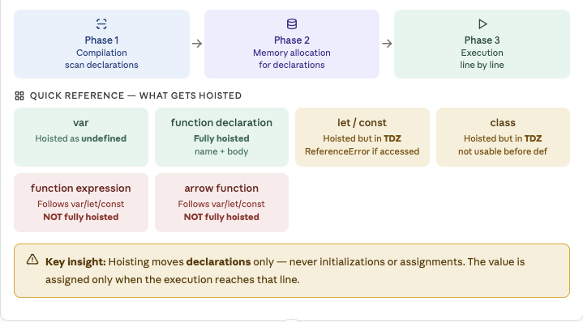

- Category: JavaScript
- Track: JavaScript
- Difficulty: Beginner
- Related: closures

### What is scope?
`Scope` = the region of code where a variable lives and can be used. Every variable you declare exists in exactly one scope. Code outside that scope simply cannot see it.

> `Real-world analogy`
> Think of scopes like rooms in a house. A variable is an object placed in a room. People in that room can use it. People in other rooms cannot — unless it's placed in the hallway (global scope) where everyone can reach it.


***Example:***
```javascript
let city = "Mumbai";     // global — everyone sees this

function kitchen() {
  let food = "pasta";        // only inside kitchen()
  if (true) {
    let steam = true;        // only inside this if-block
    console.log(city);       // ✅ "Mumbai" — global visible
    console.log(food);       // ✅ "pasta"  — same function
    console.log(steam);      // ✅ true     — same block
  }
  // console.log(steam);  // ❌ outside the if-block
}

function bedroom() {
  console.log(city);         // ✅ global is visible anywhere
  // console.log(food);    // ❌ food is in kitchen, not here
}

kitchen();
bedroom();

```
**Output:**
```
steam inside if-block → true
food in kitchen → "pasta"
city in kitchen → "Mumbai"
city in bedroom → "Mumbai"
food in bedroom → ReferenceError (can't cross functions)
```


### Scope Chain
`Scope Chain` = When JS looks for a variable, it doesn't only check the current scope. It walks outward through every parent scope until it finds the variable or reaches global and gives up `(ReferenceError)`.

> `Real-world analogy` You're searching for your keys. First check your pocket (local). Not there? Check the room (function scope). Not there? Check the hallway (global). Still not there? Keys are lost `(ReferenceError)`.


***Example:***
```javascript
let a = "global A";

function outer() {
  let b = "outer B";

  function inner() {
    let c = "inner C";

    console.log(a);  // ✅ → "global A"  (3 levels up)
    console.log(b);  // ✅ → "outer B"  (1 level up)
    console.log(c);  // ✅ → "inner C"  (same scope)
  }

  inner();
  console.log(b);  // ✅ → "outer B"
  // console.log(c); // ❌ outer can't see inside inner
}

outer();
// console.log(b); // ❌ global can't see inside outer

```

***Output:***
```
inner sees a → "global A"
inner sees b → "outer B"
inner sees c → "inner C"
outer sees b → "outer B"
outer sees c → ReferenceError (can't look inside inner)
global sees a → "global A"
global sees b → ReferenceError (can't look inside outer)

```


***Key Rule**
`Key rule:` Scope chain goes INWARD → OUTWARD only. A child can see its parent. A parent CANNOT see inside a child. Siblings cannot see each other.


### What is Hoisting?
`Hoisting` = JavaScript runs in two phases before executing your code. In the compilation phase, the engine scans for all declarations and allocates memory for them. In the execution phase, code runs line by line. Because declarations are processed before execution, they appear to be "hoisted" (lifted) to the top of their scope — even though your code hasn't changed.

 

> `Real-world analogy`
> Imagine a teacher scans the attendance sheet before class starts. They know every student exists (hoisted) — but students haven't answered questions yet. var students get marked "present but silent" (undefined). let/const students are marked "do not call yet — TDZ". function declarations are fully ready from the start. You can call a function before defining it.


***Example***
```javascript
// 1. Function declaration — fully hoisted
console.log( add(3, 4) );  // ✅ → 7  (called BEFORE definition!)
function add(a, b) { return a + b; }

// 2. var — hoisted as undefined
console.log(score);    // → undefined  (no crash, just no value yet)
var score = 100;
console.log(score);    // → 100

// 3. let — Temporal Dead Zone (TDZ)
// console.log(name); // ❌ ReferenceError: Cannot access before init
let name = "Alice";
console.log(name);     // ✅ → "Alice"

// 4. const — same TDZ as let
// console.log(PI);   // ❌ ReferenceError
const PI = 3.14159;
console.log(PI);       // ✅ → 3.14159

// 5. Function EXPRESSION — not hoisted like declaration
// multiply(2,3); // ❌ TypeError: multiply is not a function
const multiply = function(a, b) { return a * b; };
console.log(multiply(2, 3));  // ✅ → 6
```
**Output:**
```
1. add(3,4) before definition   → 7
2. var score before assignment  → undefined
2. var score after assignment   → 100
3. let before its line          → ReferenceError (TDZ)
3. let name after its line      → "Alice"
4. const PI                     → 3.14159
5. multiply(2,3)                → 6
```


**Working Flow**


### Note


### Real-world Scope & hoisting bugs
These are the exact mistakes that trip up developers in real projects. Recognising them saves hours of debugging.

***Example:***

```javascript
// BUG 1: var in a loop — all callbacks share the same i
for (var i = 0; i < 3; i++) {
  setTimeout(() => console.log(i), 100);
}
// prints: 3, 3, 3  ← NOT 0, 1, 2!
// By the time setTimeout runs, loop is done, i = 3

// FIX: use let — creates a new i for each iteration
for (let i = 0; i < 3; i++) {
  setTimeout(() => console.log(i), 100);
}
// prints: 0, 1, 2  ✅

// BUG 2: Accidental global variable
function setName() {
  name = "Alice";   // forgot let/const — creates global!
}
setName();
console.log(name);  // → "Alice" (leaked to global!)

// FIX: always declare variables
function setNameFixed() {
  let name = "Alice";   // safely scoped to function
}

// BUG 3: var hoisting giving undefined
function calculate() {
  console.log(result);  // → undefined (not an error!)
  var result = 42;
  console.log(result);  // → 42
}

// BUG 4: Shadowing — inner variable hides outer
let value = "outer";
function test() {
  let value = "inner";    // shadows outer value
  console.log(value);     // → "inner"
}
test();
console.log(value);       // → "outer" (unchanged)
```
***Output:***
```
var result before assignment → undefined
var result after assignment  → 42
inner value → "inner"
outer value after test() → "outer"

var loop bug → would print 3,3,3 (setTimeout deferred)
let loop fix → would print 0,1,2 (fresh binding each iteration)
```


> **Best Practices summary:**
> 1. Always use const first, let if needed, never var
> 2. Always declare variables (never omit keyword)
> 3. Declare variables at the TOP of their scope — avoids hoisting confusion
> 4. Use different names in inner/outer scopes to avoid shadowing bugs


**Common Mistakes:**
1. Using let/const before declaration (TDZ)
2. Accessing variables in wrong scopes
3. Thinking var makes code "flexible" (it actually creates bugs)
4. Not understanding that functions are hoisted but expressions are not


**Var Hositing**
`var declarations` are hoisted to the top of their function scope (or global scope) and initialized as `undefined`. The assignment happens only when execution reaches that line. This means you can access a var before its declaration — but you'll get `undefined`, not the assigned value.

***Example:***
```javascript
`What you write`
console.log(name);   // what does this print?
var name = "Richa";
console.log(name);   // what about this?
```
***Example:***
```javascript
`What JavaScript sees internally`
var name;            // hoisted declaration (undefined)
console.log(name);   // undefined
name = "Richa";      // assignment stays here
console.log(name);   // "Richa"
```
***Output:***
```
undefined
"Richa"
```
**Quick Check**
Line 1: var name is hoisted as undefined. Accessing it gives undefined — not an error.
Line 2: Assignment name = "Richa" runs. Now the variable has its value.
Line 3: Prints "Richa" correctly.

***Example:***
```javascript
`var inside a function (function scope)`
var x = "global";

function test() {
  console.log(x);    // undefined — NOT "global"
  var x = "local";
  console.log(x);    // "local"
}

test();
console.log(x);      // "global" — untouched
```
***Output:***
```
undefined
"local"
"global"
```
**Explanation:**

**Line 3**: `console.log(x)` runs before `var x = "local"`. Because of hoisting, the engine sees `var x` at the top of the function. So `x` exists but its value is `undefined`.
**Line 5**: `x = "local"` assigns the value. Now `x` is "local".
**Line 6**: Prints "local".
**Line 8**: Prints "global". The `var` inside `test()` only exists within that function. It does NOT affect the outer `x`.

***Quick Check***
Inside test(): var x is function-scoped to test(). It is hoisted to the top of test() as undefined — it shadows the global x. The global x is never touched inside the function.
Important: var does NOT have block scope — it ignores if/for/while blocks and leaks out to the enclosing function.

**example:**
```javascript
`var in a loop (classic bug):`
for (var i = 0; i < 3; i++) {
  setTimeout(() => console.log(i), 100);
}
// Expected: 0, 1, 2
// Actual:   3, 3, 3  ← classic hoisting bug!
```
**Output:**
```
3
3
3
```
**Explanation:**
Why? var i is function-scoped (or global) — all three closures share the same i. By the time setTimeout fires, the loop has finished and i = 3.
Fix: Use let instead — let is block-scoped, so each iteration gets its own i. Output becomes 0, 1, 2.

### Function hoisting
**Theory**
`Function declarations are fully hoisted` — both the name AND the function body are available before the function definition line. This is why you can call a function before writing it. However, function expressions and arrow functions are NOT fully hoisted — they follow the rules of the variable they are assigned to (var/let/const).

**Example:**
```javascript
`Function declaration — fully hoisted`
greet("Richa");        // works! called BEFORE definition

function greet(name) {
  console.log("Hello, " + name + "!");
}
```
**Output:**
```
Hello, Richa!
```
**Quick Check**
`Why it works:` During compilation, JavaScript reads the entire function greet and stores it in memory. By the time execution starts, greet is already fully available — name and body both hoisted.

**Example:**
```javascript
`Function expression — NOT fully hoisted`
`With var`
sayHi();   // TypeError!

var sayHi = function() {
  console.log("Hi!");
};
```
**Output:**
```
TypeError: sayHi is not a function
```
**Quick Check**
`Why?` var sayHi is hoisted as undefined. Calling undefined() throws TypeError.

**Example:**
```javascript
`With let/const`
sayBye();  // ReferenceError!

const sayBye = function() {
  console.log("Bye!");
};
```
**Output:**
```
ReferenceError: Cannot access 'sayBye' before initialization
```
**Quick Check**
`Why?` const sayBye is in TDZ. Accessing before declaration throws ReferenceError.

**Example:**
```javascript
`Arrow function — same as function expression`
add(2, 3);    // ReferenceError — in TDZ

const add = (a, b) => a + b;

```
**Output:**
```
ReferenceError: Cannot access 'add' before initialization
```
**Quick Check:**
Arrow functions are always assigned to a variable — they follow that variable's hoisting rules. const/let arrow functions are in TDZ. var arrow functions are hoisted as undefined (TypeError when called).

**Example:**
```javascript
`Function declaration vs expression — same name conflict`
var double = function(n) { return n * 2; };  // expression

function double(n) { return n * 10; }        // declaration

console.log(double(5));   // what prints?
```
**Output:**
```
10
```
**Quick Check**
`Hoisting order:` Function declarations are hoisted first. Then var declarations (as undefined) are hoisted but do NOT override the function since var double doesn't get its value until execution. At runtime, var double = function(n){return n*2} runs and overwrites the hoisted function declaration.
Result: double is the expression version → 5 * 2 = 10.


**let, const, and class hoisting**
**Theory:** `let, const, and class` ARE hoisted — the JS engine knows they exist from the start of their block. But unlike var, they are not initialized until their declaration line is reached. The gap between entering the scope and the declaration is called the `Temporal Dead Zone (TDZ)`. Accessing a variable in TDZ throws a `ReferenceError`.

**Quick Check:**
A common misconception: "let and const are NOT hoisted." They ARE hoisted — just not initialized. The TDZ is proof of hoisting: if let wasn't hoisted, the outer variable would be accessible inside the block.

**Example:**
```javascript
`Proof that let IS hoisted (TDZ proof`
let x = "outer";

{
  console.log(x);  // ReferenceError — NOT "outer"!
  let x = "inner"; // x is hoisted to top of block
}                  // but TDZ until this line
```
**Output:**
```
ReferenceError: Cannot access 'x' before initialization
```
**Quick check**
If let was NOT hoisted: JavaScript would look up the scope chain and find x = "outer". It would print "outer".
Since let IS hoisted: The inner x is known to the block from its start. It shadows the outer x but is in TDZ until its declaration line — so accessing it throws ReferenceError. This proves hoisting occurred.

**Example:**
```javascript
`const must be initialized at declaration`
// Valid
const PI = 3.14159;

// Invalid — SyntaxError
const MAX;  // missing initializer
MAX = 100;

```
**Output:**
```
SyntaxError: Missing initializer in const declaration
```
**Quick check**
`const` rule: Must be initialized when declared. Cannot be reassigned (the binding is constant). The value itself can be mutated if it is an object or array.

**Example:**
```javascript
`Class hoisting — also in TDZ`

// Function declaration — works before definition
const obj1 = new Animal("cat");  // Error!

class Animal {
  constructor(type) { this.type = type; }
}

// Must use class AFTER definition
const obj2 = new Animal("dog");  // Works
console.log(obj2.type);          // "dog"

```
**Output:**
```
ReferenceError: Cannot access 'Animal' before initialization
dog
```
**Quick check**
`Unlike function declarations`, class declarations are in TDZ — you cannot instantiate a class before its definition. This is intentional: class bodies run in strict mode, and hoisting them fully (like functions) could lead to confusing prototype setups.

---

[View Interview Questions](./interview.md)
