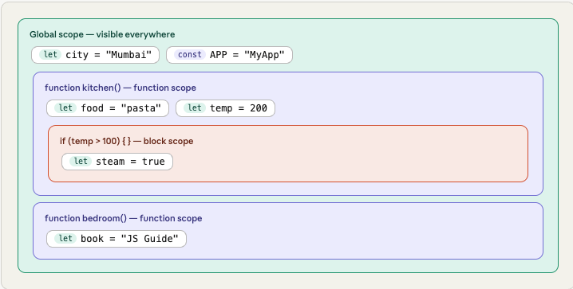
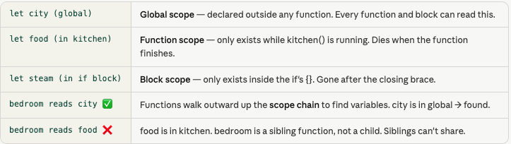
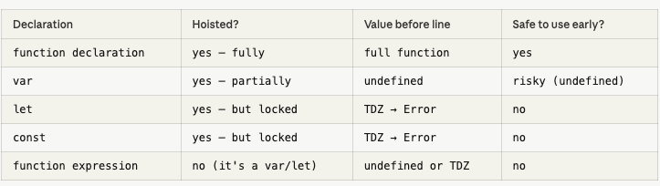
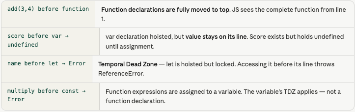
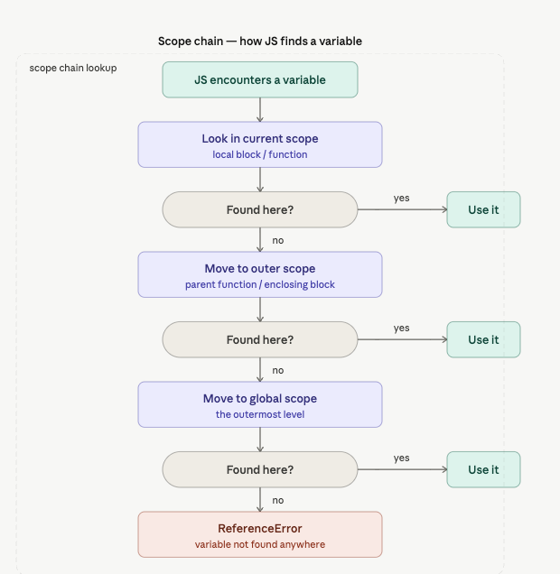
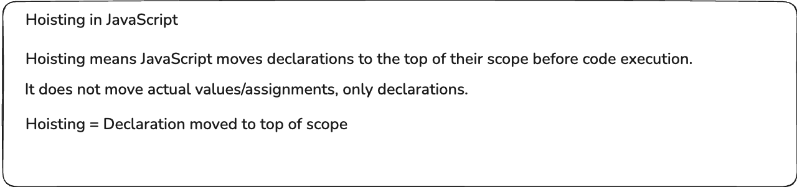

- Category: JavaScript
- Track: JavaScript
- Difficulty: Beginner
- Related: closures

### What is scope?
`Scope` = the region of code where a variable lives and can be used. Every variable you declare exists in exactly one scope. Code outside that scope simply cannot see it.

`Real-world analogy`
Think of scopes like rooms in a house. A variable is an object placed in a room. People in that room can use it. People in other rooms cannot — unless it's placed in the hallway (global scope) where everyone can reach it.



***Example:***
```javascript
let city = "Mumbai";     // global — everyone sees this

function kitchen() {
  let food = "pasta";        // only inside kitchen()
  if (true) {
    let steam = true;        // only inside this if-block
    console.log(city);       // ✅ "Mumbai" — global visible
    console.log(food);       // ✅ "pasta"  — same function
    console.log(steam);      // ✅ true     — same block
  }
  // console.log(steam);  // ❌ outside the if-block
}

function bedroom() {
  console.log(city);         // ✅ global is visible anywhere
  // console.log(food);    // ❌ food is in kitchen, not here
}

kitchen();
bedroom();

```
**Output:**
```
steam inside if-block → true
food in kitchen → "pasta"
city in kitchen → "Mumbai"
city in bedroom → "Mumbai"
food in bedroom → ReferenceError (can't cross functions)
```


### What is Hoisting?
`Hoisting` = Before running any code, JS does a first pass and registers all declarations. This is called hoisting. Function declarations are fully hoisted. var is hoisted but undefined. let/const are hoisted but locked (Temporal Dead Zone).

`Real-world analogy`
Imagine a teacher scans the attendance sheet before class starts. They know every student exists (hoisted) — but students haven't answered questions yet. var students get marked "present but silent" (undefined). let/const students are marked "do not call yet — TDZ". function declarations are fully ready from the start. You can call a function before defining it.



***Example***
```javascript
// 1. Function declaration — fully hoisted
console.log( add(3, 4) );  // ✅ → 7  (called BEFORE definition!)
function add(a, b) { return a + b; }

// 2. var — hoisted as undefined
console.log(score);    // → undefined  (no crash, just no value yet)
var score = 100;
console.log(score);    // → 100

// 3. let — Temporal Dead Zone (TDZ)
// console.log(name); // ❌ ReferenceError: Cannot access before init
let name = "Alice";
console.log(name);     // ✅ → "Alice"

// 4. const — same TDZ as let
// console.log(PI);   // ❌ ReferenceError
const PI = 3.14159;
console.log(PI);       // ✅ → 3.14159

// 5. Function EXPRESSION — not hoisted like declaration
// multiply(2,3); // ❌ TypeError: multiply is not a function
const multiply = function(a, b) { return a * b; };
console.log(multiply(2, 3));  // ✅ → 6
```
**Output:**
```
1. add(3,4) before definition   → 7
2. var score before assignment  → undefined
2. var score after assignment   → 100
3. let before its line          → ReferenceError (TDZ)
3. let name after its line      → "Alice"
4. const PI                     → 3.14159
5. multiply(2,3)                → 6
```



**Working Flow**



### Note



---

[View Interview Questions](./interview.md)
