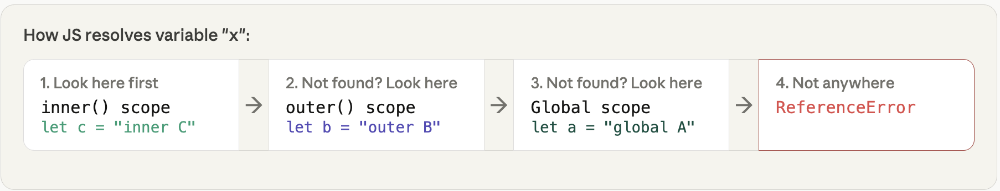
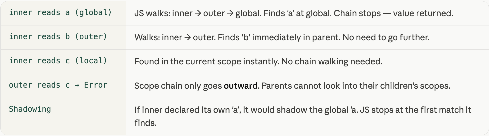
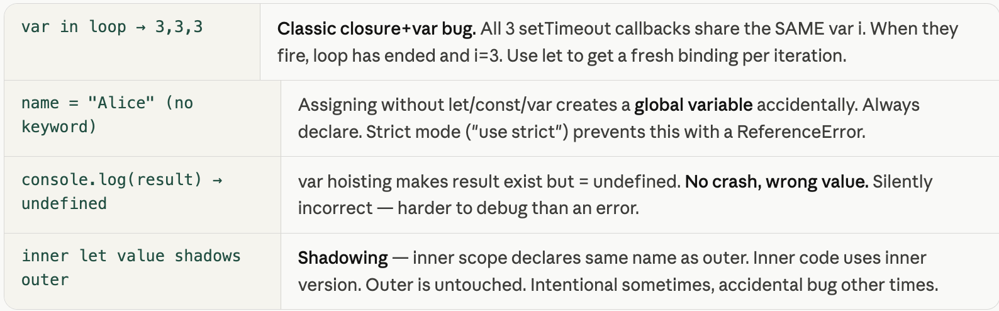

- Category: JavaScript
- Track: JavaScript
- Difficulty: Beginner
- Related: closures

### What is scope?
`Scope` = the region of code where a variable lives and can be used. Every variable you declare exists in exactly one scope. Code outside that scope simply cannot see it.

`Real-world analogy`
Think of scopes like rooms in a house. A variable is an object placed in a room. People in that room can use it. People in other rooms cannot — unless it's placed in the hallway (global scope) where everyone can reach it.


***Example:***
```javascript
let city = "Mumbai";     // global — everyone sees this

function kitchen() {
  let food = "pasta";        // only inside kitchen()
  if (true) {
    let steam = true;        // only inside this if-block
    console.log(city);       // ✅ "Mumbai" — global visible
    console.log(food);       // ✅ "pasta"  — same function
    console.log(steam);      // ✅ true     — same block
  }
  // console.log(steam);  // ❌ outside the if-block
}

function bedroom() {
  console.log(city);         // ✅ global is visible anywhere
  // console.log(food);    // ❌ food is in kitchen, not here
}

kitchen();
bedroom();

```
**Output:**
```
steam inside if-block → true
food in kitchen → "pasta"
city in kitchen → "Mumbai"
city in bedroom → "Mumbai"
food in bedroom → ReferenceError (can't cross functions)
```


### Scope Chain
`Scope Chain` = When JS looks for a variable, it doesn't only check the current scope. It walks outward through every parent scope until it finds the variable or reaches global and gives up `(ReferenceError)`.

`Real-world analogy` You're searching for your keys. First check your pocket (local). Not there? Check the room (function scope). Not there? Check the hallway (global). Still not there? Keys are lost `(ReferenceError)`.



***Example:***
```javascript
let a = "global A";

function outer() {
  let b = "outer B";

  function inner() {
    let c = "inner C";

    console.log(a);  // ✅ → "global A"  (3 levels up)
    console.log(b);  // ✅ → "outer B"  (1 level up)
    console.log(c);  // ✅ → "inner C"  (same scope)
  }

  inner();
  console.log(b);  // ✅ → "outer B"
  // console.log(c); // ❌ outer can't see inside inner
}

outer();
// console.log(b); // ❌ global can't see inside outer

```

***Output:***
```
inner sees a → "global A"
inner sees b → "outer B"
inner sees c → "inner C"
outer sees b → "outer B"
outer sees c → ReferenceError (can't look inside inner)
global sees a → "global A"
global sees b → ReferenceError (can't look inside outer)

```




***Key Rule**
`Key rule:` Scope chain goes INWARD → OUTWARD only. A child can see its parent. A parent CANNOT see inside a child. Siblings cannot see each other.


### What is Hoisting?
`Hoisting` = Before running any code, JS does a first pass and registers all declarations. This is called hoisting. Function declarations are fully hoisted. var is hoisted but undefined. let/const are hoisted but locked (Temporal Dead Zone).

`Real-world analogy`
Imagine a teacher scans the attendance sheet before class starts. They know every student exists (hoisted) — but students haven't answered questions yet. var students get marked "present but silent" (undefined). let/const students are marked "do not call yet — TDZ". function declarations are fully ready from the start. You can call a function before defining it.


***Example***
```javascript
// 1. Function declaration — fully hoisted
console.log( add(3, 4) );  // ✅ → 7  (called BEFORE definition!)
function add(a, b) { return a + b; }

// 2. var — hoisted as undefined
console.log(score);    // → undefined  (no crash, just no value yet)
var score = 100;
console.log(score);    // → 100

// 3. let — Temporal Dead Zone (TDZ)
// console.log(name); // ❌ ReferenceError: Cannot access before init
let name = "Alice";
console.log(name);     // ✅ → "Alice"

// 4. const — same TDZ as let
// console.log(PI);   // ❌ ReferenceError
const PI = 3.14159;
console.log(PI);       // ✅ → 3.14159

// 5. Function EXPRESSION — not hoisted like declaration
// multiply(2,3); // ❌ TypeError: multiply is not a function
const multiply = function(a, b) { return a * b; };
console.log(multiply(2, 3));  // ✅ → 6
```
**Output:**
```
1. add(3,4) before definition   → 7
2. var score before assignment  → undefined
2. var score after assignment   → 100
3. let before its line          → ReferenceError (TDZ)
3. let name after its line      → "Alice"
4. const PI                     → 3.14159
5. multiply(2,3)                → 6
```


**Working Flow**


### Note


### Real-world Scope & hoisting bugs
These are the exact mistakes that trip up developers in real projects. Recognising them saves hours of debugging.

***Example:***

```javascript
// BUG 1: var in a loop — all callbacks share the same i
for (var i = 0; i < 3; i++) {
  setTimeout(() => console.log(i), 100);
}
// prints: 3, 3, 3  ← NOT 0, 1, 2!
// By the time setTimeout runs, loop is done, i = 3

// FIX: use let — creates a new i for each iteration
for (let i = 0; i < 3; i++) {
  setTimeout(() => console.log(i), 100);
}
// prints: 0, 1, 2  ✅

// BUG 2: Accidental global variable
function setName() {
  name = "Alice";   // forgot let/const — creates global!
}
setName();
console.log(name);  // → "Alice" (leaked to global!)

// FIX: always declare variables
function setNameFixed() {
  let name = "Alice";   // safely scoped to function
}

// BUG 3: var hoisting giving undefined
function calculate() {
  console.log(result);  // → undefined (not an error!)
  var result = 42;
  console.log(result);  // → 42
}

// BUG 4: Shadowing — inner variable hides outer
let value = "outer";
function test() {
  let value = "inner";    // shadows outer value
  console.log(value);     // → "inner"
}
test();
console.log(value);       // → "outer" (unchanged)
```
***Output:***
```
var result before assignment → undefined
var result after assignment  → 42
inner value → "inner"
outer value after test() → "outer"

var loop bug → would print 3,3,3 (setTimeout deferred)
let loop fix → would print 0,1,2 (fresh binding each iteration)
```



***Best Practices summary:**
1. Always use const first, let if needed, never var
2. Always declare variables (never omit keyword)
3. Declare variables at the TOP of their scope — avoids hoisting confusion
4. Use different names in inner/outer scopes to avoid shadowing bugs


**Common Mistakes:**
1. Using let/const before declaration (TDZ)
2. Accessing variables in wrong scopes
3. Thinking var makes code "flexible" (it actually creates bugs)
4. Not understanding that functions are hoisted but expressions are not

---

[View Interview Questions](./interview.md)
