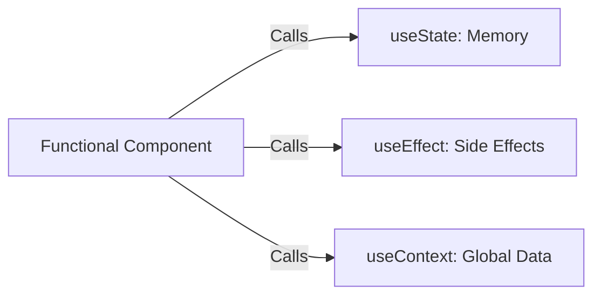

- Category: React Core
- Track: React
- Difficulty: Beginner
- Related: useState, useEffect, custom-hooks

### What are React Hooks?
Introduced in React 16.8, **Hooks** are functions that let you "hook into" React state and lifecycle features from functional components. They allow you to use React features without writing a class.

---

### 1. The Hook Concept
**Working Flow: Functional Logic**

---

### 2. The Rules of Hooks
React Hooks have two essential rules that you must follow:

1. **Only Call Hooks at the Top Level**: Don't call Hooks inside loops, conditions, or nested functions. This ensures Hooks are called in the same order every time.
2. **Only Call Hooks from React Functions**: Call Hooks from React functional components or custom Hooks. Don't call them from regular JavaScript functions.

---

### 3. Core Hooks Overview

| Hook | Purpose |
| :--- | :--- |
| **useState** | Adds local state to your component. |
| **useEffect** | Handles side effects (API calls, subscriptions). |
| **useContext** | Accesses data from the Context API. |
| **useRef** | References a DOM element or persists a value without re-rendering. |
| **useMemo** | Memoizes a calculated value (Performance). |
| **useCallback** | Memoizes a function (Performance). |

---

### 4. Why use Hooks?
**Theory**: Before Hooks, you had to use complex patterns like Higher-Order Components (HOCs) or Render Props to share stateful logic. Hooks simplify this by allowing you to extract logic into **Custom Hooks**, making your code flatter and more readable.

---

### 5. Summary Table: Comparison

| Feature | Class Component | Functional Component with Hooks |
| :--- | :--- | :--- |
| **State** | `this.state` | `useState` |
| **Lifecycle** | `componentDidMount` | `useEffect(fn, [])` |
| **Logic Sharing** | Mixins / HOCs | **Custom Hooks** |

---

[View Interview Questions](./interview.md)
