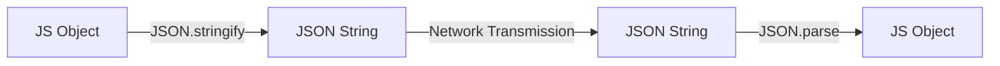

- Category: JavaScript
- Track: JavaScript
- Difficulty: Beginner
- Related: object-methods, restful-api

### What is JSON?
**JSON** (JavaScript Object Notation) is a text-based format for representing structured data based on JavaScript object syntax. It is the most common format for exchanging data between servers and web applications.

---

### 1. Data Exchange Flow
**Working Flow: From App to Server and Back**



---

### 2. Syntax Rules & Data Types

#### The Strict Rules
| Feature | Rule | Example |
| :--- | :--- | :--- |
| **Quotes** | Always double quotes `"` | `"name": "Richa"` |
| **Commas** | No trailing commas | `{"a":1}` (Not `{"a":1,}`) |
| **Comments** | **Not allowed** | (JSON cannot contain `//`) |

#### Supported vs Unsupported
- **Supported**: Strings, Numbers, Objects, Arrays, Booleans, `null`.
- **Unsupported**: Functions, `undefined`, Symbols, Dates (converted to ISO string).

---

### 3. Comprehensive Examples

#### Deep Cloning (The Shortcut)
**Theory**: You can create a complete copy of a simple object by stringifying it and parsing it back. This breaks the reference link.
```javascript
const original = { name: "Richa", details: { role: "Dev" } };

// Quick deep clone
const clone = JSON.parse(JSON.stringify(original));

clone.details.role = "Manager";
console.log(original.details.role); // "Dev" (Unchanged!)
```

#### Handling Circular References
**Theory**: `JSON.stringify` will throw an error if an object refers to itself (circular reference).
```javascript
const obj = {};
obj.self = obj;
// JSON.stringify(obj); // ❌ Error: Converting circular structure to JSON
```

---

### 4. Comparison: JS Object vs JSON

| Feature | JS Object | JSON String |
| :--- | :--- | :--- |
| **Nature** | Memory reference / Instance | Plain Text (String) |
| **Functions** | Can contain methods | **Data only** |
| **Key Quotes** | Optional (mostly) | **Mandatory** |

---

[View Interview Questions](./interview.md)
