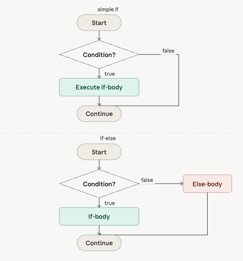
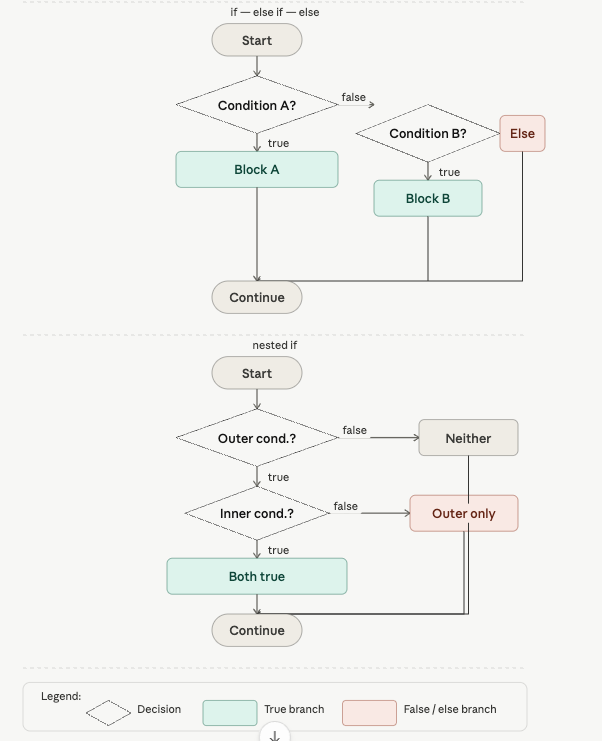
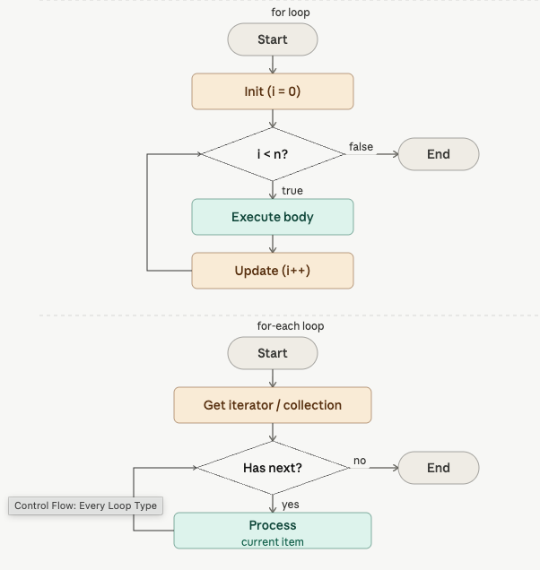

- Category: Fundamentals
- Track: Fundamentals
- Difficulty: Beginner
- Related: conditionals

### What are Loops?
The classic loop. Three parts in the (): initializer, condition checked before each pass, update run after each pass.

### 1. If /  Else If / Else
**Theory**: The most fundamental way to make decisions in code. JS evaluates the condition in () and runs the matching block.

**Example**:
```javascript
let temperature = 35;

if (temperature > 40) {
  console.log("Extreme heat!");
} else if (temperature > 30) {
  console.log("Hot day");     // ← this runs
} else if (temperature > 20) {
  console.log("Warm day");
} else {
  console.log("Cool or cold");
}
// One-liner (no braces) — only for single statements
let x = 10;
if (x > 5) console.log("big");  // → big

```
**Output**
```
temperature 35 → "Hot day" x=10, x>5 → "big"
```

**Explanation**
```javascript
if (temperature > 40) {
Evaluates the condition. If true, runs this block and skips all others.
} else if (temperature > 30) {
Only checked if the first if was false. 35 > 30, so this runs.
} else {
Fallback — runs only if every condition above was false.
if (x > 5) console.log("big");
Single-line form. Fine for simple cases, use braces for multi-line.

```

**Working Flow**


### 2. Switch Statements
**Theory**: switch is cleaner than many else-if chains when matching one variable against exact values. The break stops fall-through.

**Example**:
```javascript
let day = "Monday";

switch (day) {
  case "Saturday":
  case "Sunday":
    console.log("Weekend!");
    break;
  case "Monday":
    console.log("Start of week"); // ← runs
    break;
  case "Friday":
    console.log("Almost there!");
    break;
  default:
    console.log("Weekday");
}

```
**Output**
```
day = "Monday" → "Start of week"
```

**Explanation**
```javascript
switch (day) {
Evaluates day once, then jumps to the matching case.
case "Saturday": case "Sunday":
Two cases with no break between them — both lead to the same block (fall-through on purpose).
break;
Exits the switch. Without break, execution falls through to the next case.
default:
Runs when no case matches. Like else in if/else.
```

***Nested Conditionals:***



### 3. For Loop
**Theory**: Best when you know exactly how many times you want to repeat.

**Key Features**:
- **Initializer**: Where it starts.
- **Condition**: When it stops.
- **Step**: How it changes each time.

**Example**:
```javascript
// Basic for loop — count 1 to 5
for (let i = 1; i <= 5; i++) {
  console.log(i);     // → 1 2 3 4 5
}

// Loop over an array
let fruits = ["apple", "banana", "mango"];
for (let i = 0; i < fruits.length; i++) {
  console.log(fruits[i]);
}

// for...of — cleaner for arrays (modern)
for (let fruit of fruits) {
  console.log(fruit);
}

```
**Output**
```
1 to 5: 1, 2, 3, 4, 5 
fruits: apple, banana, mango
```

**Explanation**
```javascript
let i = 1; i <= 5; i++
Start at 1. Keep going while i <= 5. Add 1 after each iteration.
i < fruits.length
fruits.length is 3. Loop runs for i=0, i=1, i=2 then stops.
fruits[i]
Access array element by index. fruits[0] = 'apple', fruits[1] = 'banana', etc.
for (let fruit of fruits)
for...of gives you the value directly — no index needed. Use for arrays.

```


### 4. While Loop
**Theory**: while checks the condition before each iteration. do-while always runs at least once — then checks.

**Key Features**:
- **Condition-first**: Checks before running code.
- **Risk**: Can become an infinite loop if condition never fails.

**Example**:
```javascript
l// while — runs while condition is true
let n = 1;
while (n <= 3) {
  console.log(n);   // → 1 2 3
  n++;
}

// do-while — runs at least once
let attempt = 1;
do {
  console.log("Attempt: " + attempt);
  attempt++;
} while (attempt <= 3);

// break & continue
for (let i = 0; i < 5; i++) {
  if (i === 2) continue;   // skip 2
  if (i === 4) break;      // stop at 4
  console.log(i);          // → 0 1 3
}
```

**Output**
```
while 1-3: 1, 2, 3 break/continue: 0, 1, 3
```

**Explanation**:
```javascript
while (n <= 3) {
Checks n <= 3 before entering. Once n becomes 4, exits.
do { ... } while (attempt <= 3);
Body runs first. Then checks. Useful for menus, retries.
if (i === 2) continue;
Skip the rest of this iteration, go to next i.
if (i === 4) break;
Exit the entire loop immediately.
```
---

[View Interview Questions](./interview.md)
