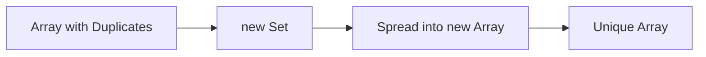

- Category: JavaScript
- Track: JavaScript
- Difficulty: Intermediate
- Related: object-methods, array-methods

### What are Map and Set?
Introduced in ES6, **Map** and **Set** are specialized collections that provide better performance and more flexibility than traditional Objects and Arrays for specific tasks like unique value storage or complex key mapping.

---

### 1. Removing Duplicates Flow
**Working Flow: The "Set" Shortcut**



---

### 2. Map (Advanced Key-Value)

#### Map vs Object
| Feature | Object | Map |
| :--- | :--- | :--- |
| **Key Types** | String / Symbol only | **Any type** (Obj, Fn, etc.) |
| **Order** | Mostly ordered | **Guaranteed** insertion order |
| **Size** | Manual (`Object.keys().length`) | **.size** property |
| **Performance** | Good | **Better** for frequent add/remove |

#### Iterating over Map
```javascript
const userMap = new Map([["id", 1], ["name", "Richa"]]);

for (const [key, value] of userMap) {
  console.log(`${key}: ${value}`);
}
```

---

### 3. Set (Unique Collections)

#### Common Use Case: Array Deduplication
**Theory**: The easiest way to remove duplicates from an array is to convert it to a Set and then back to an Array.
```javascript
const dups = [1, 1, 2, 3, 3, 4];
const unique = [...new Set(dups)];
console.log(unique); // [1, 2, 3, 4]
```

#### Set Methods
| Method | Description |
| :--- | :--- |
| `add(val)` | Adds a unique value |
| `has(val)` | Returns true if exists |
| `delete(val)` | Removes a value |
| `clear()` | Removes all values |

---

### 4. WeakMap & WeakSet (Briefly)
**Theory**: "Weak" versions of these collections do not prevent garbage collection. If an object used as a key in a `WeakMap` is deleted elsewhere, it is automatically removed from the `WeakMap` too. 
- **Keys must be objects**.
- **Not iterable** (size is not accessible).

---

[View Interview Questions](./interview.md)
