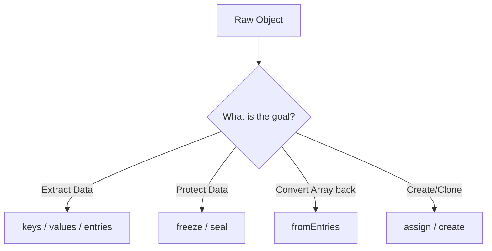

- Category: JavaScript
- Track: JavaScript
- Difficulty: Beginner
- Related: data-types, es6-features, prototypes

### What are Object Methods?
Objects are the foundation of JavaScript. While objects store data in **key-value pairs**, the global `Object` constructor provides powerful static methods to manipulate, protect, and inspect these structures.

---

### 1. Object Manipulation Flow
**Working Flow**



---

### 2. Core Method Categories

#### Data Extraction
| Method | Description | Output for `{a:1}` |
| :--- | :--- | :--- |
| `keys(obj)` | Returns array of keys | `["a"]` |
| `values(obj)` | Returns array of values | `[1]` |
| `entries(obj)` | Returns array of `[key, value]` | `[["a", 1]]` |

#### Protection & Integrity
| Method | Can Add? | Can Delete? | Can Update? |
| :--- | :--- | :--- | :--- |
| **Normal** | ✅ | ✅ | ✅ |
| `seal(obj)` | ❌ | ❌ | ✅ |
| `freeze(obj)` | ❌ | ❌ | ❌ |

---

### 3. Advanced Examples

#### Object.fromEntries()
**Theory**: The inverse of `entries()`. It transforms a list of key-value pairs into an object. Useful for cleaning data.
```javascript
const entries = [["name", "Richa"], ["role", "Dev"]];
const user = Object.fromEntries(entries);
console.log(user); // { name: "Richa", role: "Dev" }
```
**Output**: `{ name: "Richa", role: "Dev" }`

#### Freezing vs Sealing
```javascript
const settings = { theme: "dark" };

Object.freeze(settings);
settings.theme = "light"; // Silently fails (or throws in strict mode)
console.log(settings.theme); // "dark"
```
**Output**: `dark`

---

### 4. Cloning vs Merging
**Theory**: While `Object.assign()` was the standard, the ES6 **Spread Operator** (`...`) is now the preferred way to clone or merge objects.
```javascript
const base = { id: 1 };
const details = { name: "Richa" };

// Merging
const combined = { ...base, ...details }; 

// Cloning
const clone = { ...base };
```

---

[View Interview Questions](./interview.md)
