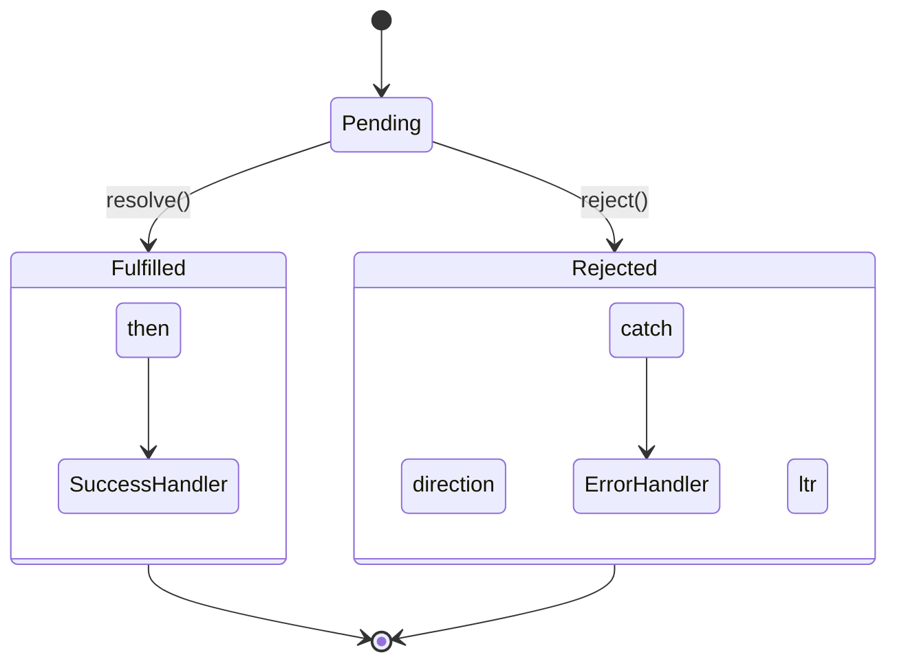

- Category: JavaScript
- Track: JavaScript
- Difficulty: Intermediate
- Related: async-await, event-loop

### What are Promises?
A **Promise** is a proxy for a value not necessarily known when the promise is created. It allows you to associate handlers with an asynchronous action's eventual success value or failure reason.

---

### 1. Promise State Machine
**Working Flow: From Pending to Settled**



---

### 2. Core Promise Concepts

#### The Three States
| State | Description |
| :--- | :--- |
| **Pending** | Initial state, neither fulfilled nor rejected. |
| **Fulfilled** | The operation completed successfully. |
| **Rejected** | The operation failed. |

#### Promise Chaining
**Theory**: Promises solve "Callback Hell" by allowing you to chain `.then()` calls. Each `.then()` returns a **new promise**.
```javascript
fetchData()
  .then(user => getRoles(user.id))
  .then(roles => console.log(roles))
  .catch(err => console.error(err))
  .finally(() => console.log("Done"));
```

---

### 3. Static Methods (Handling Multiple Promises)

| Method | Description | Behavior |
| :--- | :--- | :--- |
| `Promise.all()` | Wait for ALL | Rejects if **any** promise fails. |
| `Promise.allSettled()` | Wait for ALL | Returns status of all, even if some fail. |
| `Promise.race()` | First to finish | Returns result of the **very first** settler. |
| `Promise.any()` | First success | Returns the first **fulfilled** promise. |

---

### 4. Comprehensive Examples

#### Creating a Wrapper (Promisification)
```javascript
const delay = (ms) => new Promise(resolve => setTimeout(resolve, ms));

delay(2000).then(() => console.log("Runs after 2 seconds"));
```

#### Promise.all in Action
```javascript
const p1 = Promise.resolve(3);
const p2 = 42; // Treated as a resolved promise
const p3 = new Promise((res) => setTimeout(res, 100, "foo"));

Promise.all([p1, p2, p3]).then(values => {
  console.log(values); // [3, 42, "foo"]
});
```
**Output**: `[3, 42, "foo"]`

---

[View Interview Questions](./interview.md)
