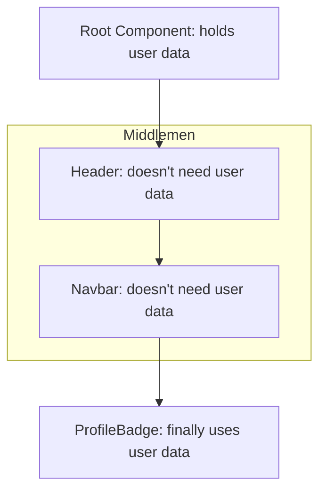

- Category: React Patterns
- Track: React
- Difficulty: Intermediate
- Related: props-vs-state, context-api, redux

### What is Prop Drilling?
**Prop Drilling** is the process of passing data from a parent component down through several layers of intermediate components to reach a deeply nested child component that actually needs the data.

---

### 1. The Prop Drilling Problem
**Working Flow: Passing through Middlemen**



---

### 2. Why is it a problem?
**Theory**: While prop drilling is a natural part of React's "one-way data flow", it becomes a problem in large applications because:
- **Maintenance**: Changing the data structure requires updating every intermediate component.
- **Readability**: It makes components harder to understand as they are receiving props they don't use.
- **Boilerplate**: It adds unnecessary code to many files.

---

### 3. How to avoid Prop Drilling

#### 1. Component Composition
**Theory**: Instead of passing data, pass the component itself as a prop (`children`).
```tsx
function App() {
  return (
    <Layout>
      <UserBadge user={user} />
    </Layout>
  );
}
```

#### 2. Context API (Recommended)
**Theory**: Context provides a way to pass data through the component tree without having to pass props manually at every level.
```tsx
const UserContext = createContext();

function App() {
  return (
    <UserContext.Provider value={user}>
      <DeeplyNestedComponent />
    </UserContext.Provider>
  );
}
```

#### 3. State Management Libraries
**Theory**: Tools like **Redux** or **Zustand** store state in a central location that any component can access directly.

---

### 4. Summary: When is Prop Drilling okay?

| Scenario | Recommendation |
| :--- | :--- |
| **2-3 Levels deep** | ✅ Totally fine (don't over-engineer) |
| **Simple Data** | ✅ Fine |
| **Global State (Auth/Theme)** | ❌ Use Context |
| **Deep & Complex Tree** | ❌ Use Context or Redux |

---

[View Interview Questions](./interview.md)
