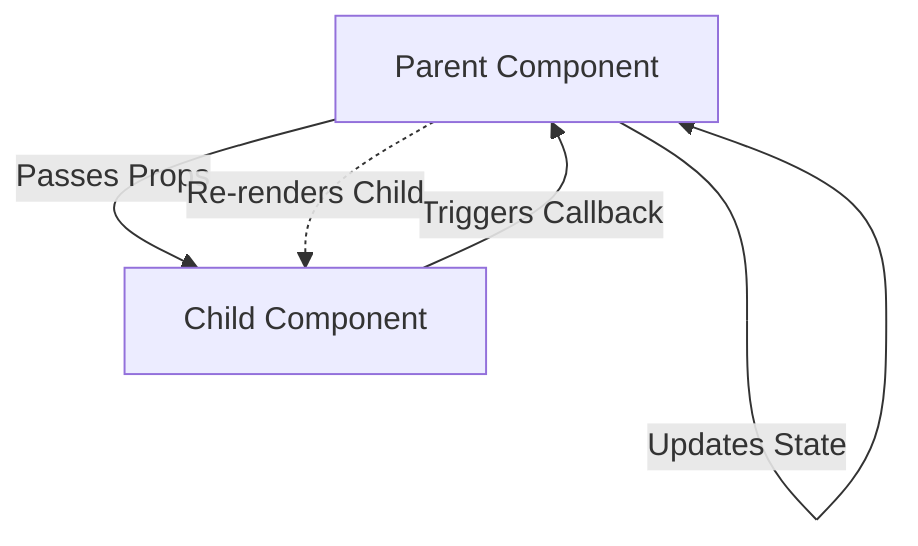

- Category: React Fundamentals
- Track: React
- Difficulty: Beginner
- Related: useState, useContext, props-drilling

### Props vs State
**Props** and **state** are the two main types of data that control a React component. While they both trigger a re-render when changed, they serve different purposes: Props are like **arguments** passed to a function, while State is like **local variables** inside a function.

---

### 1. Unidirectional Data Flow
**Working Flow: One-Way Traffic**



---

### 2. Side-by-Side Comparison

| Feature | Props | State |
| :--- | :--- | :--- |
| **Source** | Received from Parent | Managed within Component |
| **Mutability** | **Immutable** (Read-Only) | **Mutable** (via setter) |
| **Purpose** | Configuration / Data Sharing | Interactivity / Local Memory |
| **Access** | `props.name` or `{name}` | `const [val, setVal]` |

---

### 3. Comprehensive Examples

#### Passing Props (Parent to Child)
**Theory**: Props are passed as attributes on the JSX tag. They allow components to be reusable.
```tsx
function Button({ label, color }) {
  return <button style={{ backgroundColor: color }}>{label}</button>;
}

// Usage
<Button label="Save" color="green" />
<Button label="Delete" color="red" />
```

#### Managing State (Internal Memory)
**Theory**: State allows a component to remember things (like text in an input or whether a modal is open).
```tsx
function Counter() {
  const [count, setCount] = useState(0);
  return <button onClick={() => setCount(count + 1)}>Count: {count}</button>;
}
```

---

### 4. Advanced Concepts

#### Lifting State Up
**Theory**: If two components need to share the same data, move the state to their common parent and pass it down as props.

#### Prop Drilling
**Theory**: Passing props through multiple layers of components just to reach a deep child. This is a common "pain point" solved by **Context API** or **Redux**.

---

### 5. Summary Table: Which one to use?

- **Use Props** if the data comes from outside and the component just needs to display it.
- **Use State** if the data changes over time due to user interaction or API calls within the component.

---

[View Interview Questions](./interview.md)
