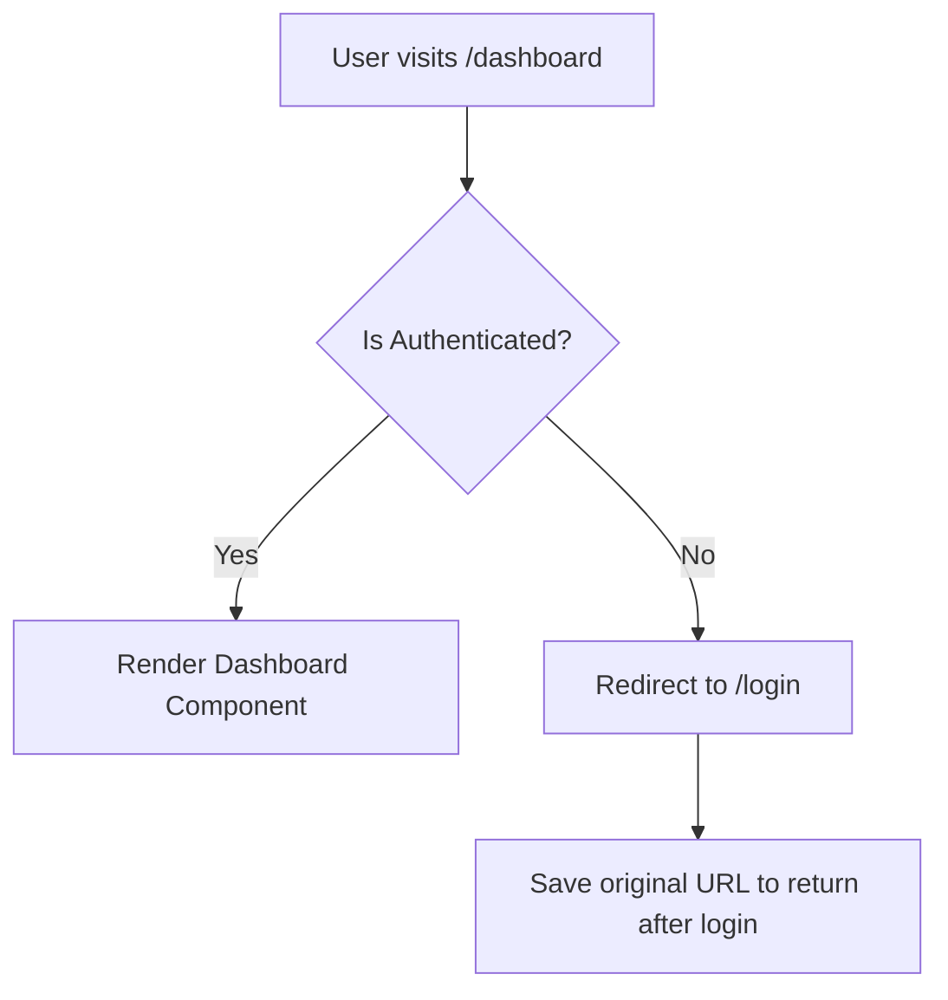

- Category: React Architecture
- Track: React
- Difficulty: Intermediate
- Related: props-vs-state, api-calls-react

### What are Protected Routes?
**Protected Routes** are routes in a web application that require a user to be authenticated (logged in) before they can access the content. If an unauthenticated user tries to visit a protected page, they are typically redirected to the login page.

---

### 1. Protection Logic Flow
**Working Flow: Authorization Check**



---

### 2. Implementation with React Router
**Theory**: You create a wrapper component that checks the authentication state. If the user is logged in, it renders the child components; otherwise, it uses the `<Navigate />` component to redirect.

```tsx
import { Navigate, Outlet } from 'react-router-dom';

const ProtectedRoute = ({ isAuthenticated }) => {
  if (!isAuthenticated) {
    // Redirect to login if not authenticated
    return <Navigate to="/login" replace />;
  }

  // Render children (or the nested route via Outlet)
  return <Outlet />;
};

// Usage in App.js
<Routes>
  <Route path="/login" element={<Login />} />
  <Route element={<ProtectedRoute isAuthenticated={user} />}>
    <Route path="/dashboard" element={<Dashboard />} />
    <Route path="/profile" element={<Profile />} />
  </Route>
</Routes>
```

---

### 3. Key Concepts

#### Auth Context
It is best practice to store the authentication state (user data, token) in a **Context API** so that the `ProtectedRoute` component can access it easily without prop drilling.

#### Persistent Login
Check for a saved token in `localStorage` or a `httpOnly` cookie when the app first loads to keep the user logged in across refreshes.

---

### 4. Comparison: Client-Side vs Server-Side Protection

| Feature | Client-Side (React) | Server-Side (API) |
| :--- | :--- | :--- |
| **Goal** | Improve UX (hide UI) | **Real Security** (protect data) |
| **Logic** | Redirection in Browser | Token verification in Backend |
| **Bypassable?** | Yes (via console/code) | **No** (if done correctly) |

---

### 5. Summary: Security Warning
**IMPORTANT**: Protected routes in React are only for **User Experience**. A clever user can always bypass client-side checks. You **MUST** always verify authentication/authorization on your **Server/API** for every single request that returns sensitive data.

---

[View Interview Questions](./interview.md)
