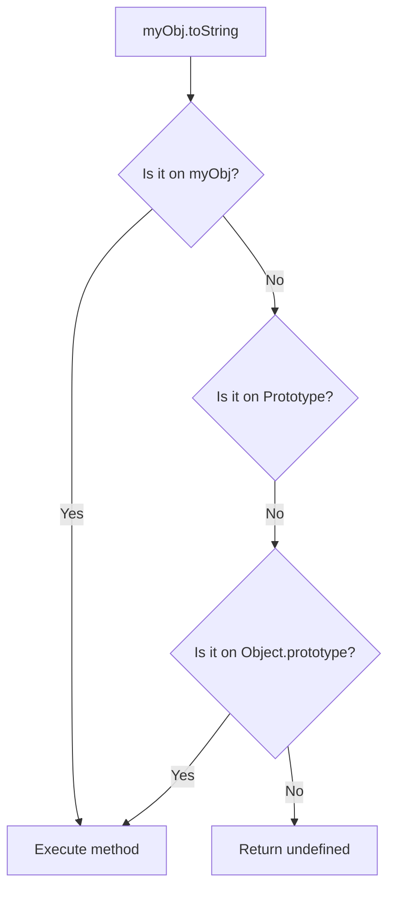

- Category: JavaScript
- Track: JavaScript
- Difficulty: Advanced
- Related: classes-objects, this-keyword

### What is a Prototype?
JavaScript is a **prototype-based** language. This means that objects inherit properties and methods directly from other objects. While ES6 introduced the `class` keyword, it is actually "syntactic sugar" over JavaScript's underlying prototypal system.

---

### 1. Prototype Chain Lookup
**Working Flow: How JS finds a property**



---

### 2. Core Prototypal Concepts

#### The Prototype Chain
**Theory**: Every object has a link to another object called its **prototype**. This continues until it reaches `null`, which marks the end of the chain.
```javascript
const arr = [1, 2, 3];
// arr -> Array.prototype -> Object.prototype -> null
```

#### Property Shadowing
**Theory**: If an object and its prototype have a property with the same name, the object's own property "shadows" (wins over) the prototype's.
```javascript
const parent = { color: "red" };
const child = Object.create(parent);
child.color = "blue"; 

console.log(child.color); // "blue"
```
**Output**: `blue`

#### prototype vs __proto__
- `prototype`: A property of **constructor functions** used to build the chain for instances.
- `__proto__`: A property of an **instance** that points to its actual prototype object.

---

### 3. Comprehensive Examples

#### Method Sharing (Efficiency)
**Theory**: Instead of giving every instance its own copy of a function, we put it on the prototype once to save memory.
```javascript
function User(name) {
  this.name = name;
}

// Share this method across ALL User instances
User.prototype.greet = function() {
  console.log(`Hi, I'm ${this.name}`);
};

const u1 = new User("Alice");
const u2 = new User("Bob");

u1.greet(); // Works
u2.greet(); // Works
```

---

### 4. Summary Table

| Feature | Description | Example |
| :--- | :--- | :--- |
| **Object.create()** | Creates object with specific proto | `Object.create(obj)` |
| **hasOwnProperty()** | Checks if property is NOT on proto | `obj.hasOwnProperty('x')` |
| **[[Prototype]]** | The internal link to parent | Accessible via `__proto__` |

---

[View Interview Questions](./interview.md)
