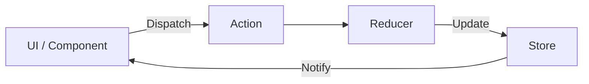

- Category: State Management
- Track: React
- Difficulty: Advanced
- Related: props-vs-state, context-api

### What is Redux?
**Redux** is a pattern and library for managing and updating application state, using events called "actions". It serves as a centralized store for state that needs to be used across your entire application, with rules ensuring that the state can only be updated in a predictable fashion.

---

### 1. The Redux Data Flow
**Working Flow: Unidirectional Pattern**



---

### 2. The Three Pillars of Redux

#### 1. The Store
**Theory**: The single "source of truth" that holds the entire state tree of your application.
```javascript
import { configureStore } from '@reduxjs/toolkit';
const store = configureStore({ reducer: counterReducer });
```

#### 2. Actions
**Theory**: Plain JavaScript objects that describe **what happened**. They must have a `type` field.
```javascript
const incrementAction = { type: 'counter/increment', payload: 1 };
```

#### 3. Reducers
**Theory**: Functions that take the current state and an action, and return a **new state**. They must be **pure functions** (no side effects, no mutations).
```javascript
function counterReducer(state = { value: 0 }, action) {
  if (action.type === 'counter/increment') {
    return { ...state, value: state.value + action.payload };
  }
  return state;
}
```

---

### 3. Redux Toolkit (The Modern Way)
**Theory**: Redux Toolkit (RTK) is the official, recommended way to write Redux logic. It simplifies store setup and reduces "boilerplate" code.
```javascript
import { createSlice } from '@reduxjs/toolkit';

const counterSlice = createSlice({
  name: 'counter',
  initialState: { value: 0 },
  reducers: {
    increment: state => {
      // RTK allows "mutating" logic because it uses Immer internally!
      state.value += 1;
    }
  }
});

export const { increment } = counterSlice.actions;
```

---

### 4. When to use Redux?

| Use Case | Recommended? |
| :--- | :--- |
| **Large App** | ✅ Yes (complex data sharing) |
| **Frequent Updates** | ✅ Yes (high performance) |
| **Simple Toggle** | ❌ No (use `useState`) |
| **Theme/Auth** | ❌ No (consider `Context API`) |

---

[View Interview Questions](./interview.md)
