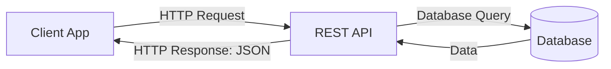

- Category: Backend
- Track: Web Development
- Difficulty: Beginner
- Related: json, api-calls-react

### What is a RESTful API?
**REST** (Representational State Transfer) is an architectural style for designing networked applications. A **RESTful API** uses HTTP requests to GET, PUT, POST, and DELETE data.

---

### 1. The Request-Response Cycle
**Working Flow: Client to Server**



---

### 2. HTTP Verbs (The "CRUD" Operations)
REST uses standard HTTP methods to perform actions on resources:

| Method | CRUD Action | Purpose | Example Path |
| :--- | :--- | :--- | :--- |
| **GET** | Read | Retrieve data | `/users/1` |
| **POST** | Create | Add new data | `/users` |
| **PUT** | Update | Replace existing data | `/users/1` |
| **PATCH** | Update | Modify part of data | `/users/1` |
| **DELETE** | Delete | Remove data | `/users/1` |

---

### 3. HTTP Status Codes
The server tells the client what happened using status codes:

- **200 OK**: Success!
- **201 Created**: Successfully added a new resource.
- **400 Bad Request**: Client sent invalid data.
- **401 Unauthorized**: User needs to log in.
- **404 Not Found**: The resource doesn't exist.
- **500 Server Error**: Something went wrong on the server.

---

### 4. Comprehensive Examples

#### A Standard GET Request
```javascript
// Fetching a specific user
fetch("https://api.example.com/users/123")
  .then(res => res.json())
  .then(user => console.log(user));
```

#### A POST Request (Sending Data)
```javascript
fetch("https://api.example.com/users", {
  method: "POST",
  headers: { "Content-Type": "application/json" },
  body: JSON.stringify({ name: "Richa", role: "Dev" })
});
```

---

### 5. Summary: Key Principles of REST
1. **Stateless**: The server doesn't remember previous requests.
2. **Uniform Interface**: All resources are accessed via consistent URLs.
3. **Client-Server**: Separation of concerns between UI and Data.

---

[View Interview Questions](./interview.md)
