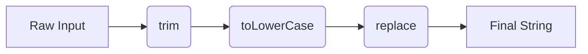

- Category: JavaScript
- Track: JavaScript
- Difficulty: Beginner
- Related: data-types, regex

### What are String Methods?
Strings in JavaScript are primitive data types. However, JavaScript provides a "wrapper" that gives them built-in methods to search, slice, modify, and format text easily.

**Important**: Strings are **immutable**. Methods do not change the original string; they always return a **new string**.

---

### 1. String Transformation Pipeline
**Working Flow**



---

### 2. Core Method Categories

#### Extracting Parts
| Method | Description | Example |
| :--- | :--- | :--- |
| `slice(s, e)` | Extracts from `s` to `e` (exclusive) | `"Apple".slice(0, 3) // "App"` |
| `split(sep)` | Converts string to array | `"a,b".split(",") // ["a", "b"]` |

#### Searching & Inspection
| Method | Description | Example |
| :--- | :--- | :--- |
| `includes(str)` | Returns true/false if found | `"JS".includes("J") // true` |
| `startsWith(str)` | Checks if it starts with str | `"Hi".startsWith("H") // true` |
| `indexOf(str)` | Returns index or -1 | `"Hi".indexOf("i") // 1` |

#### Formatting & Cleanup
| Method | Description | Example |
| :--- | :--- | :--- |
| `trim()` | Removes outer whitespace | `" a ".trim() // "a"` |
| `replace(s, r)` | Replaces first match | `"a b".replace(" ", "-") // "a-b"` |
| `padStart(n, s)` | Pads start to length `n` | `"5".padStart(2, "0") // "05"` |

---

### 3. Comprehensive Examples

#### The Split & Join Pattern
**Theory**: Very common for transforming text by converting to an array, modifying, and converting back.
```javascript
const slug = "Hello World From JS";
const final = slug.toLowerCase().split(" ").join("-");
console.log(final); // "hello-world-from-js"
```
**Output**: `hello-world-from-js`

#### Pad and Mask
```javascript
const card = "1234567890123456";
const lastFour = card.slice(-4);
const masked = lastFour.padStart(card.length, "*");
console.log(masked); // "************3456"
```
**Output**: `************3456`

---

### 4. Comparison: slice() vs substring()
| Feature | `slice()` | `substring()` |
| :--- | :--- | :--- |
| **Negative Args** | Counts from the end | Treated as `0` |
| **Start > End** | Returns `""` | Swaps the arguments |

---

[View Interview Questions](./interview.md)
