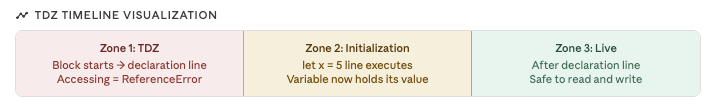
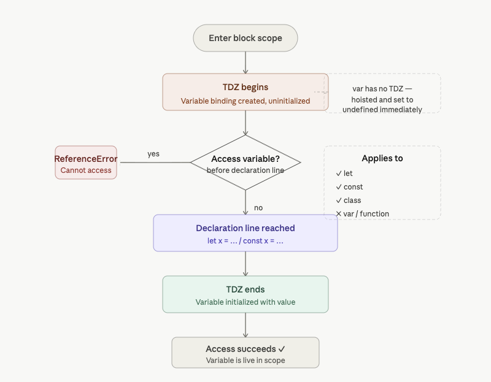

- Category: JavaScript
- Track: JavaScript
- Difficulty: Beginner
- Related: closures

### Temporal Dead Zone (TDZ) deep dive
**Theory**: The Temporal Dead Zone is the period from the start of a block to the point where a let/const/class variable is initialized. During TDZ, the variable exists in memory but cannot be read or written. Any attempt throws a ReferenceError. TDZ exists to catch bugs caused by using variables before they're set up.



**Example:**
```javascript
{
  // ---- TDZ starts for 'score' here ----

  // console.log(score);  // ReferenceError (in TDZ)
  // score = 10;          // ReferenceError (in TDZ)
  // typeof score;        // "undefined" ← ONLY safe operation in TDZ

  let score = 100;        // TDZ ends here — score = 100

  // ---- Safe zone ----
  console.log(score);     // 100
  score = 200;
  console.log(score);     // 200
}
```
**Output:**
```
ReferenceError: Cannot access 'score' before initialization
100
200
```
**Quick Check:**
`typeof exception:` typeof on a TDZ variable returns "undefined" instead of throwing — this is the ONLY operation allowed in TDZ. All others (read, write, delete) throw ReferenceError.
`Practical use:` typeof x === "undefined" is safe even in TDZ, useful for feature detection.

**Example:**
```javascript
`TDZ with function parameters`
// Default params are evaluated left to right
function greet(name, greeting = name.toUpperCase()) {
  console.log(greeting);
}
greet("richa");   // "RICHA"

// TDZ with default params referencing later param
function bad(a = b, b = 1) {  // b is in TDZ when a is evaluated
  return a + b;
}
bad();  // ReferenceError: b is not defined
```
**Output:**
```
RICHA
ReferenceError: Cannot access 'b' before initialization
```
**Quick Check:**
`Default parameters have their own TDZ`. Each parameter is initialized left to right. When evaluating a's default (= b), b hasn't been initialized yet — it's in TDZ. This throws ReferenceError.

**Working Flow**




---

[View Interview Questions](./interview.md)
