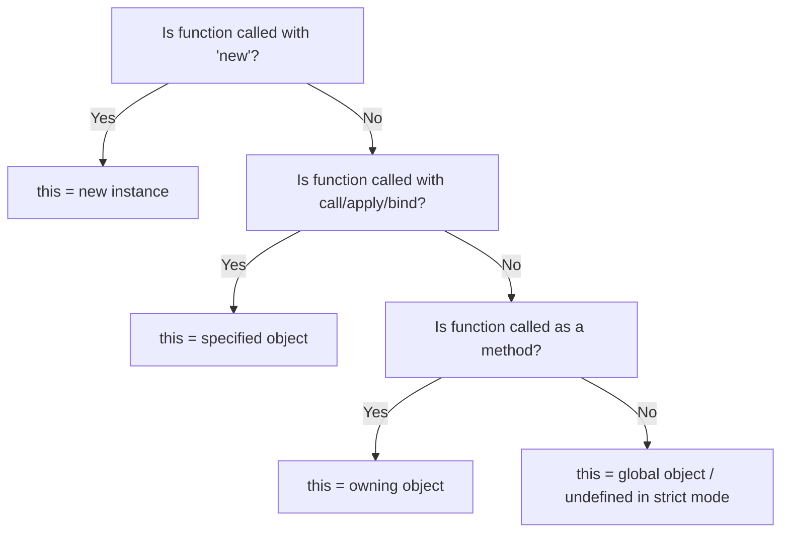

- Category: JavaScript
- Track: JavaScript
- Difficulty: Intermediate
- Related: closures, es6-features

### What is the "this" Keyword?
The `this` keyword refers to the **object that is currently executing the code**. Think of it as a pronoun (like "I" or "me") that refers to the owner of the function being executed.

Its value is NOT fixed; it depends entirely on **how** the function is called.

---

### 1. The Four Binding Rules
To understand `this`, you must check how the function was invoked:

| Rule | How it's called | Value of `this` |
| :--- | :--- | :--- |
| **Global** | `foo()` | `window` (or `global` in Node) |
| **Implicit** | `obj.foo()` | The object before the dot (`obj`) |
| **Explicit** | `foo.call(obj)` | The object passed into call/apply/bind |
| **New** | `new Foo()` | The newly created instance |

---

### 2. Execution Context & Flow
**Working Flow**



---

### 3. Examples & Use Cases

#### Implicit Binding (Object Methods)
```javascript
const person = {
  name: "Richa",
  greet() {
    console.log(`Hi, I am ${this.name}`);
  }
};

person.greet(); // → "Hi, I am Richa"
```
**Output**: `Hi, I am Richa`

#### Explicit Binding (call, apply, bind)
```javascript
function welcome() {
  console.log(`Welcome, ${this.name}`);
}

const user = { name: "John" };

welcome.call(user); // → "Welcome, John"
```
**Output**: `Welcome, John`

#### Arrow Functions (Lexical this)
**Theory**: Arrow functions do not have their own `this`. They capture the `this` value of the enclosing lexical context.
```javascript
const group = {
  title: "Devs",
  members: ["Alice", "Bob"],
  show() {
    this.members.forEach((m) => {
      console.log(`${this.title}: ${m}`); // Inherits 'this' from show()
    });
  }
};

group.show();
```
**Output**:
```
Devs: Alice
Devs: Bob
```

---

### 4. Common Pitfalls
1. **Losing Binding**: When you pass an object method as a callback, `this` often defaults back to `window`.
2. **Strict Mode**: In strict mode, if `this` isn't set, it remains `undefined` rather than defaulting to `window`.

---

[View Interview Questions](./interview.md)
