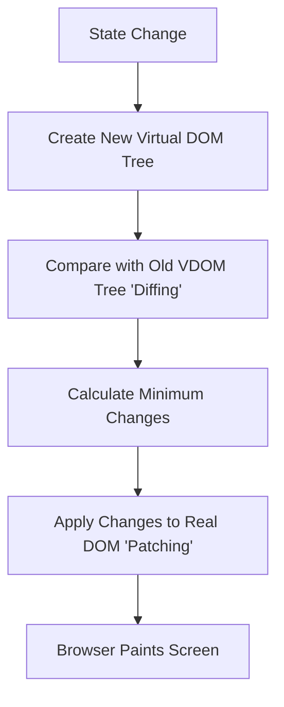

- Category: React Core
- Track: React
- Difficulty: Intermediate
- Related: dom, props-vs-state

### What is the Virtual DOM?
The **Virtual DOM (VDOM)** is a programming concept where an "ideal", or "virtual", representation of a UI is kept in memory and synced with the "real" DOM by a library such as ReactDOM. This process is called **Reconciliation**.

---

### 1. Reconciliation Flow
**Working Flow: How React Updates the UI**



---

### 2. Why is the Virtual DOM needed?
**Theory**: Manipulating the real DOM is slow because it triggers browser processes like "Reflow" and "Repaint" for the entire layout. The Virtual DOM allows React to calculate exactly what changed in memory first, making updates much faster.

#### The "Diffing" Algorithm
React uses a highly optimized algorithm to compare trees. It follows two main assumptions:
1. Two elements of different types will produce different trees.
2. Developers can hint at which child elements are stable across renders with a `key` prop.

---

### 3. Key Concepts

#### Reconciliation
The process of synchronizing the Virtual DOM with the Real DOM.

#### Diffing
The process of finding the difference between the current VDOM and the previous one.

#### Batching
React often groups multiple state updates into a single re-render to further improve performance.

---

### 4. Comparison: Real DOM vs Virtual DOM

| Feature | Real DOM | Virtual DOM |
| :--- | :--- | :--- |
| **Update Speed** | Slow | **Very Fast** |
| **Memory Usage** | High | Low |
| **Element Type** | HTML Object | JavaScript Object |
| **Rendering** | Direct | Through reconciliation |

---

### 5. Best Practice: Keys in Lists
**Theory**: Always provide a unique `key` to list items. This helps the diffing algorithm identify which items were added, moved, or removed, preventing unnecessary re-renders.
```tsx
{items.map(item => (
  <li key={item.id}>{item.text}</li>
))}
```

---

[View Interview Questions](./interview.md)
